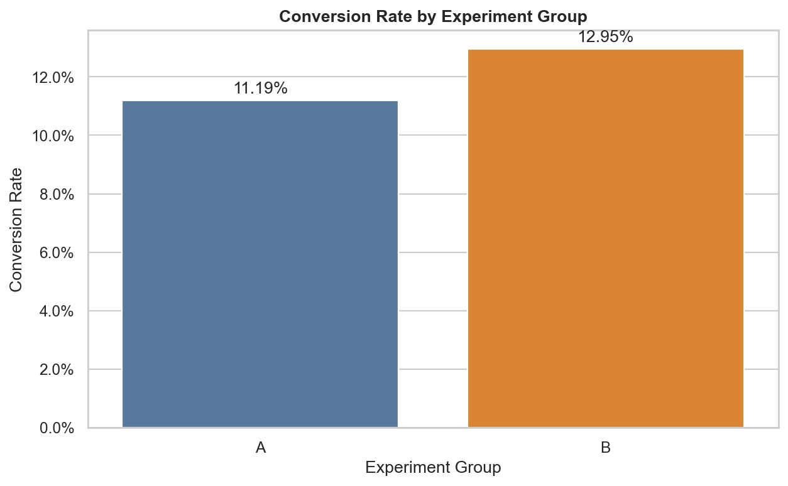
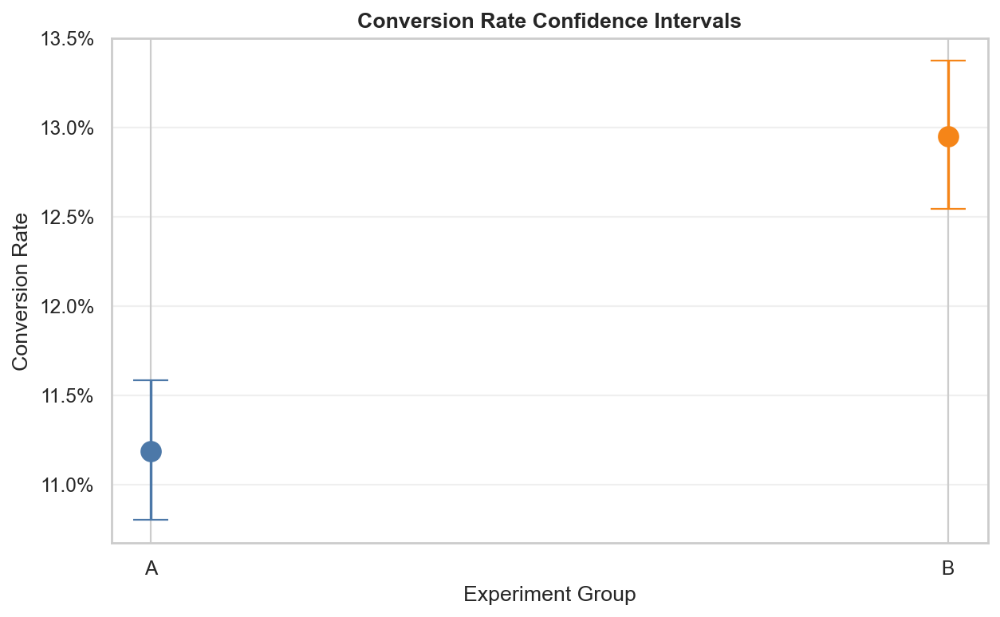
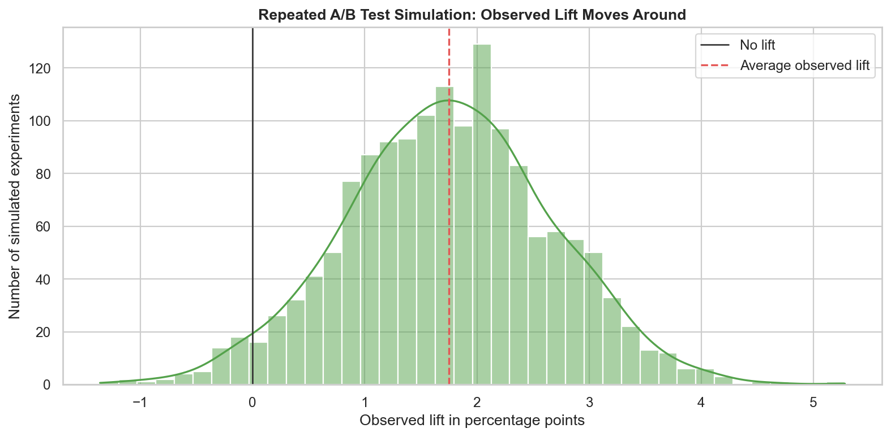

# How Tech Companies Use Experiments to Make Billion-Dollar Decisions - A/B Testing Explained Intuitively

## Subtitle

What if businesses could scientifically test ideas instead of relying on opinions and guesswork?

## The Moment Before the Decision

Imagine a product team staring at a new checkout page.

The designer loves it. The copywriter loves it. The product manager says it feels cleaner. The executive says it looks more premium. Everyone in the room has a theory about why customers will trust it more and buy more.

Then the data scientist asks the question that makes the room quieter:

> How do we know?

That question is the beginning of A/B testing.

A/B testing exists because businesses are full of confident opinions, and confident opinions are not the same as truth. Users do not behave inside slide decks. They behave in a messy real world full of distractions, hesitation, habits, device constraints, time pressure, and emotional friction.

A button can look better and convert worse.

A headline can sound clever and confuse people.

A checkout flow can feel elegant to the team that built it and feel risky to the customer trying to enter a credit card number.

A/B testing is how modern companies ask reality to vote.



## Why Opinions Are Dangerous

Product decisions often begin as stories.

Someone says the new homepage will feel more trustworthy. Someone says a shorter form will increase signups. Someone says the recommendation carousel will increase order value. These ideas may be good. They may even be obvious.

But business history is full of obvious ideas that failed when real users touched them.

The danger is not that humans have intuition. Intuition is useful. It helps us create hypotheses. The danger is when intuition gets promoted into certainty before it has earned the right.

A/B testing creates a controlled contest between two realities.

In one reality, users see the current product.

In the other reality, users see the changed product.

If users are randomly assigned and measured fairly, the difference in outcomes becomes evidence.

That is the quiet power of experimentation: it lets the business learn without betting the entire company on a guess.

## What A/B Testing Actually Does

At its simplest, A/B testing compares two versions:

- Version A: the control, or current experience
- Version B: the treatment, or new experience

Users are randomly assigned to one version. Then the business measures an outcome, such as conversion, signup, retention, purchase, revenue per user, click-through rate, or completed onboarding.

The key word is randomly.

Randomization is what makes the comparison fair. Without it, the treatment might accidentally get better users, better traffic, better timing, or better geography. Then the team might credit the product change for something the product did not cause.

A good experiment tries to make the two groups identical except for one thing: the experience being tested.

That is why A/B testing feels so close to a medical trial. One group receives the existing treatment. Another receives the new treatment. The comparison is designed to isolate the effect.

## The Checkout Experiment

In this project, we simulate an ecommerce checkout experiment.

The company currently uses an old checkout call-to-action. The team believes customers may feel more confident if the button and checkout language emphasize security.

So we test:

- Control A: old checkout CTA
- Treatment B: new secure checkout CTA

Each user is randomly assigned to A or B. We track whether they convert. We also keep realistic context fields like device, country, traffic source, timestamp, and revenue.

This makes the dataset feel like a real product experiment instead of a sterile statistics worksheet.

The business question is not: did B have a bigger number in one sample?

The real question is:

> Is the evidence strong enough to believe the new checkout experience improves conversion in the real world?

## Why Randomness Makes Experiments Hard

Suppose the control converts at 10.2% and the treatment converts at 11.3%.

That sounds promising.

But experiments are noisy. Users are not coins in a lab. Some people arrive ready to buy. Some are just browsing. Some are on mobile. Some are distracted. Some came from email. Some came from an ad. Some would have purchased no matter what button they saw.

Even when a treatment has no real effect, random assignment can produce a difference.

This is why A/B testing is not just comparing two conversion rates and celebrating the larger one.

Imagine flipping a fair coin 20 times. You might get 13 heads. That does not mean the coin is biased. It means small samples move around.

Now imagine flipping it 20,000 times. A big difference becomes much harder to explain away as luck.

Experiments behave the same way.

Small tests are volatile. Large tests are steadier. But even large tests need uncertainty estimates because the observed sample is still only one window into a larger user population.

## The Null Hypothesis

Hypothesis testing begins with skepticism.

The null hypothesis says:

> The treatment does not change conversion.

That may sound pessimistic, but it is actually protective. It prevents teams from believing every random bump is a breakthrough.

The alternative hypothesis says:

> The treatment does change conversion.

The experiment then asks: if the null hypothesis were true, how surprising would our observed result be?

This is where the p-value enters.

## P-Values Without the Fog

A p-value is often explained badly.

It is not the probability that the treatment works. It is not the probability that the null hypothesis is true. It is not a certificate of business success.

A p-value asks:

> If there were really no treatment effect, how often would random noise produce a result at least this extreme?

If that probability is very small, the observed result becomes harder to dismiss as random noise.

A common threshold is 0.05. If p < 0.05, teams often call the result statistically significant.

But significance is not the end of thinking. It is the beginning of responsible interpretation.

A statistically significant result can still be too small to matter. A non-significant result can still be promising if the experiment was underpowered. A significant lift can disappear later if the test had tracking bugs, peeking bias, or seasonal distortion.

Good experimenters do not worship p-values. They use them as one instrument on a larger dashboard.

## Conversion Rates and Lift

Conversion rate is the heartbeat of many experiments.

It is simply:

```text
conversions / users exposed
```

If 2,500 users see the treatment and 290 convert, the conversion rate is 11.6%.

Lift compares treatment performance to control performance.

Absolute lift is the difference in percentage points.

Relative lift is the difference compared with the control baseline.

For example, moving from 10% to 11% conversion is:

- 1 percentage point absolute lift
- 10% relative lift

That sounds small until traffic scale enters the room.

If a site has 1,000,000 monthly checkout visitors, a 1 percentage-point lift means 10,000 more monthly conversions. If each conversion is worth $85, that is $850,000 in extra monthly revenue before considering costs and margins.

This is why experimentation powers modern technology companies. Small improvements become enormous when multiplied across millions of users.

## Confidence Intervals: The Shape of Uncertainty

A point estimate says the treatment lift is 1.1 percentage points.

A confidence interval says the plausible lift might be between 0.4 and 1.8 percentage points.

That range is where decision-making becomes more honest.



Confidence intervals remind us that the observed experiment is not the entire universe. It is one sample. The true effect could be a little higher or lower.

When a confidence interval for lift is entirely above zero, the evidence supports a positive effect. When it crosses zero, the result is ambiguous. When it is very wide, the experiment is telling us that we do not know enough yet.

This is the emotional maturity of experimentation: being willing to say, “The data is not clear enough.”

## Type I and Type II Errors

A/B testing is decision-making under risk. Two mistakes matter.

A Type I error is a false positive.

The team launches a treatment because the experiment says it worked, but the treatment does not actually help. The business ships a bad idea because random noise wore a convincing costume.

A Type II error is a false negative.

The team rejects a treatment because the experiment does not find enough evidence, but the treatment actually helps. The business walks away from a good idea because the test was too small or noisy to see it.

These errors are not abstract. They have product consequences.

A false positive might launch a confusing checkout flow that quietly reduces trust.

A false negative might bury a small improvement that could have created millions of dollars at scale.

The goal is not perfect certainty. The goal is disciplined risk management.

## Sample Size and Power

Small samples are dramatic.

They swing. They tease. They produce exciting spikes and disappointing drops.

Large samples are calmer. They make randomness less dominant.

Statistical power is the probability that an experiment detects a real effect when that effect exists. If power is low, the test may miss meaningful improvements.

This is especially important because many business effects are small. A new checkout button usually will not double conversion. It might improve conversion by 0.5 or 1.0 percentage points.

Detecting that kind of effect requires enough users.

Underpowered experiments are like listening for a whisper in a noisy room. The signal may be there, but the test cannot hear it.

## Why Peeking Breaks Trust

One of the most common experiment mistakes is peeking.

The team starts a test. The first day looks good. Someone checks again after lunch. Still good. The next morning, p < 0.05. Everyone celebrates and stops the test.

The problem is that noisy experiments wander. If you keep checking repeatedly and stop the moment the result looks significant, you increase the chance of a false positive.

It is like rolling dice until you get the number you want and then claiming the dice proved your theory.

Good experimentation defines the plan before the result becomes emotionally tempting.

## Business Significance vs Statistical Significance

A result can be statistically significant and strategically irrelevant.

Suppose the treatment improves conversion by 0.03 percentage points. With a huge sample, that difference might be statistically significant. But if implementation is expensive or the feature complicates the product, the business may still reject it.

On the other hand, a 1.5 percentage-point lift with a wide confidence interval might deserve a follow-up test even if it narrowly misses significance.

Business decisions require more than p-values.

They require impact, cost, risk, user experience, engineering effort, long-term effects, and ethical judgment.

A/B testing gives evidence. Humans still have to make the decision.

## Simulating Randomness

One of the most eye-opening parts of the project is the repeated experiment simulation.

We run the same kind of experiment many times in simulation and watch the observed lift move around.



Some simulated experiments underestimate the true effect. Some overestimate it. Some appear significant. Some do not.

This visual makes a quiet truth impossible to ignore:

> One experiment result is a measurement, not a prophecy.

The more we understand randomness, the less likely we are to mistake luck for product genius.

## Real-World Applications

A/B testing is everywhere in modern technology.

Ecommerce companies test checkout flows, product page layouts, free shipping messages, and recommendation systems.

Streaming platforms test thumbnails, ranking algorithms, onboarding flows, and retention interventions.

Search engines test result layouts, ads, snippets, and ranking changes.

Social platforms test feed designs, notification strategies, creator tools, and safety interventions.

Growth teams test emails, landing pages, pricing pages, referral prompts, and trial experiences.

The common thread is simple: when user behavior matters, experiments help companies learn.

## The Final Takeaway

A/B testing is not a dry statistical ritual.

It is a way of thinking.

It says product decisions should be treated as hypotheses. It says uncertainty should be measured instead of ignored. It says user behavior deserves more authority than internal opinion.

The best teams do not use experiments to remove judgment. They use experiments to improve judgment.

GraphX Labs takeaway:

> Opinions can inspire experiments. Evidence decides what earns the rollout.

## GitHub Repository

GitHub repo placeholder: `<ADD_GITHUB_REPOSITORY_LINK>`

## Companion Interview Article

Companion article placeholder: `A/B Testing Interview Questions Explained Like a Real Data Scientist`
