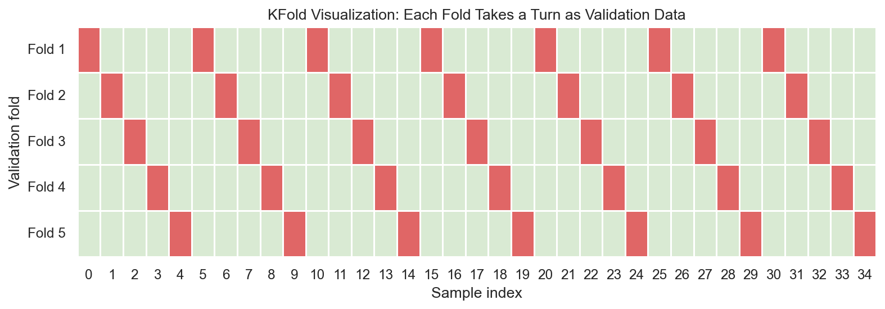
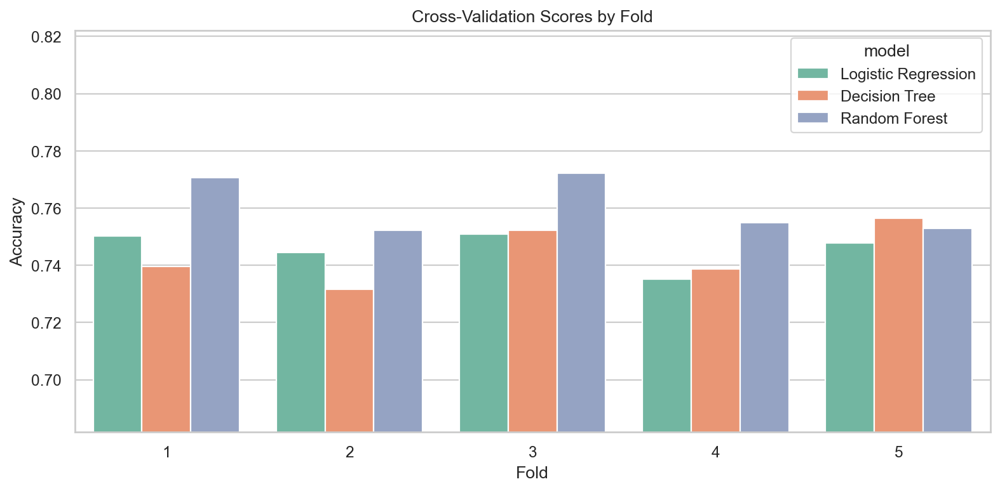
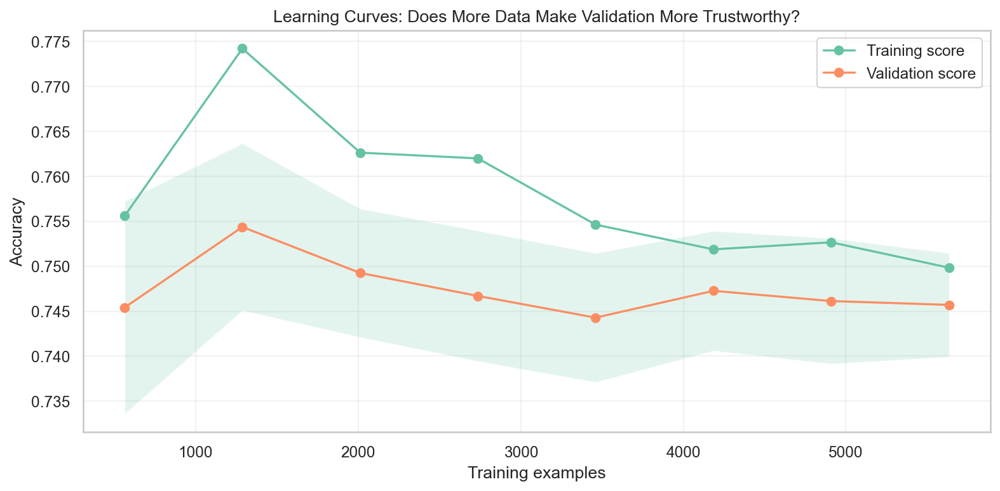

# Why One Train-Test Split Can Lie to You - Cross Validation Explained Intuitively

## How machine learning engineers learn whether a model is truly reliable... or just got lucky once

There is a quiet danger in machine learning.

It does not look like an error message. It does not crash your notebook. It often appears as something much more comforting:

> Accuracy: 84%

That number feels like progress.

But before we trust it, we need to ask a more uncomfortable question:

> What if the model just got lucky?

One train-test split is only one version of reality. It is one shuffle of the deck. One doorway into the data. One exam for the model.

Maybe the test set was easy. Maybe it was unusually hard. Maybe the risky customers landed in training instead of testing. Maybe the model looked stable because the split quietly protected it from the cases that would expose its weakness.

This is why Cross Validation matters.

Cross Validation is not just a technical procedure. It is one of the ways machine learning engineers learn whether a model can actually be trusted.

> A single train-test split can lie to you. Cross Validation helps you see the bigger picture.

## The Hidden Problem With Model Evaluation

Machine learning evaluation is hard because the future is invisible.

We train on old data, but we care about new data. We evaluate on a test set, but production will not be exactly that test set. The model will meet new customers, new behavior, new seasons, new market conditions, and new edge cases.

So when someone says, "The model got 84% accuracy," the real engineering response is:

> How stable is that number?

A model that scores 84% once may not be reliable.

A model that scores around 84% across many different validation folds is much more trustworthy.

The difference is consistency.

And consistency is where trust begins.

## Why One Split Is Dangerous

Imagine judging a student from one exam.

If the exam happens to cover their strongest chapters, they look brilliant. If it covers their weakest chapters, they look unprepared. One exam tells you something, but it does not tell the full story.

Now imagine testing an athlete from one race.

Maybe they slept badly. Maybe the weather was perfect. Maybe the competition was unusually weak. One race is evidence, not certainty.

Now imagine evaluating a business from one month of revenue.

One month could be holiday season. One month could include a promotion. One month could be distorted by a one-time event.

A train-test split works the same way.

It is one sample of possible evaluation reality.

In the Cross Validation project, we use the IBM Telco Customer Churn dataset. The goal is to predict whether a customer will churn. The dataset includes tenure, charges, contract type, internet service, payment method, and support features.

When we split this data once, the score depends on which customers land in training and which customers land in testing.

That split may be fair.

It may also be lucky.

## The Idea Behind Cross Validation

Cross Validation asks the model to prove itself more than once.

Instead of creating one train-test split and treating it like the final truth, Cross Validation divides the data into folds. The model trains on some folds and validates on the remaining fold. Then the validation fold rotates.

Each fold gets a turn.

The model is trained and tested repeatedly.

At the end, we get a set of scores.

That set of scores is more useful than one score because it reveals two things:

- how well the model performs on average
- how much the performance changes across folds

The average score tells us typical performance.

The standard deviation tells us stability.

This is the heart of Cross Validation:

> It turns model evaluation from one snapshot into a pattern.

## K-Fold Explained Visually

In K-Fold Cross Validation, the dataset is split into `k` folds.

If `k = 5`, the model trains and validates five times.

Each time:

- four folds are used for training
- one fold is used for validation
- the validation fold rotates

By the end, every row has had a chance to be in validation data.

This is powerful because the model is no longer judged by one fixed partition. It must perform across several partitions.

If it performs well every time, trust increases.

If performance jumps around, that is a warning.

The warning may mean the model is unstable, the dataset is small, the classes are imbalanced, or the problem has difficult subgroups.

Either way, Cross Validation tells us something one split cannot.

## Stratified K-Fold

Classification problems often have class imbalance.

In churn prediction, more customers stay than leave. Churned customers are the minority class.

If we use ordinary KFold, one validation fold might contain a slightly different churn rate than another. That can make one fold easier or harder, not because the model changed, but because the fold composition changed.

StratifiedKFold solves this by preserving the target distribution in each fold.

If the full dataset has around the same percentage of churned customers, each fold should have roughly that same percentage.

This matters because we want folds to be fair mirrors of the whole dataset.

For classification problems, StratifiedKFold is often the more trustworthy default.

## Measuring Stability

A single score says:

> Here is what happened once.

Cross Validation says:

> Here is what happened repeatedly.

That repeated evidence lets us measure stability.

Suppose two models have similar average accuracy:

- Model A: 82%, 82%, 83%, 82%, 83%
- Model B: 76%, 89%, 80%, 86%, 78%

Their averages may not be wildly different, but they feel very different.

Model A is steady.

Model B is volatile.

In production, volatility is risk.

If the model's performance depends heavily on which customers appear in validation, the model may be sensitive to data shifts.

This is why fold variance matters.

The mean score tells us how strong the model is.

The standard deviation tells us how much we should trust that strength.

## Fold Variance

Fold variance is the movement in scores across validation folds.

Low variance means the model performs similarly across different slices of data.

High variance means performance changes a lot depending on the fold.

High fold variance can happen for several reasons:

- the model is too sensitive
- the dataset is small
- the classes are imbalanced
- there are unusual customer subgroups
- features are unstable
- the model is overfitting

This is not just a statistical detail. It is practical debugging information.

If a churn model performs well on some folds and poorly on others, a business team should not blindly trust the average. The model may fail on certain customer segments.

Cross Validation helps reveal that risk before deployment.

## Hyperparameter Tuning

Hyperparameters are settings we choose before training.

For a Decision Tree, examples include:

- maximum depth
- minimum samples per leaf
- split criteria

If we tune hyperparameters on one train-test split, we may accidentally choose settings that work only for that split.

That is another form of false confidence.

`GridSearchCV` solves this by testing hyperparameter combinations across folds. It asks:

> Which settings perform consistently across repeated validation?

This is much more reliable than choosing settings from one lucky score.

Cross-validated tuning does not guarantee perfection, but it reduces the chance that we optimize for one accident.

## Cross Validation and Overfitting

Cross Validation can also expose overfitting.

During tuning, we can compare training scores and validation scores.

If the training score keeps rising while the validation score stalls or drops, the model is getting better at memorizing training folds but not better at generalizing.

That is the old overfitting story in a new setting.

The model is rehearsing too well.

Cross Validation gives us repeated evidence of that gap.

Instead of seeing overfitting on one split, we can see whether it persists across folds.

## Learning Curves

Learning curves show how training and validation performance change as the amount of training data grows.

They answer practical questions:

- Is the model underfitting?
- Is the model overfitting?
- Would more data help?
- Is validation performance stabilizing?

If both training and validation scores are low, the model may be too simple or the features may be weak.

If training score is high and validation score is much lower, the model may be overfitting.

If validation score improves as training size increases, more data may help.

Learning curves are useful because they turn evaluation into diagnosis.

## Real-World ML Validation

In real projects, engineers usually do not rely on one score.

A practical validation workflow looks like this:

1. Split off a final test set and do not touch it during development.
2. Use Cross Validation on the training data for model selection and tuning.
3. Compare average performance and fold variance.
4. Inspect learning curves and validation curves.
5. Check for data leakage.
6. Choose a model that is strong and stable.
7. Evaluate once on the final test set.

This workflow protects the final test set from becoming part of the tuning process.

The final test set should feel like a sealed envelope. You open it only after the model decisions are made.

## Final Takeaway

Cross Validation matters because one score is fragile.

One split can flatter a weak model.

One split can punish a strong model.

One split can hide instability.

Cross Validation makes the model face multiple versions of the data. It asks not only, "Can you perform?" but also, "Can you perform consistently?"

That is why Cross Validation is not just a KFold explanation.

It is one of the reasons machine learning models can be trusted.

GitHub repo placeholder: `[Add GitHub link here]`

Companion interview article placeholder: `[Add Medium interview article link here]`

