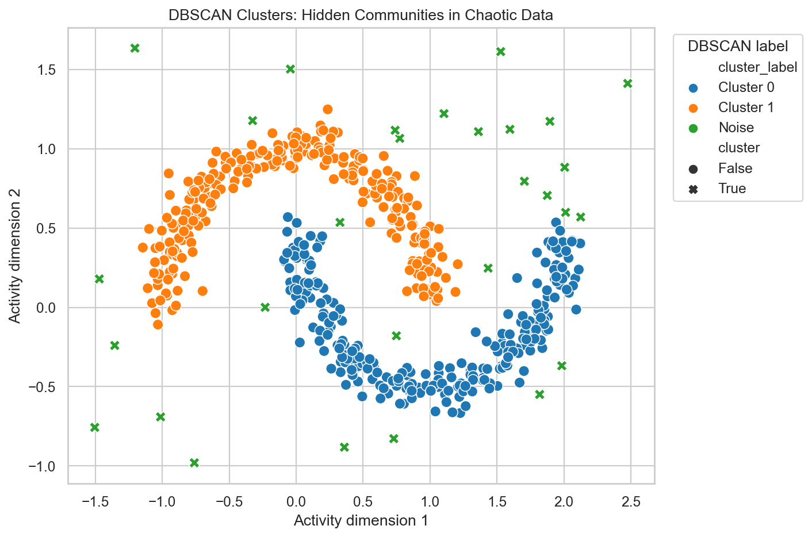
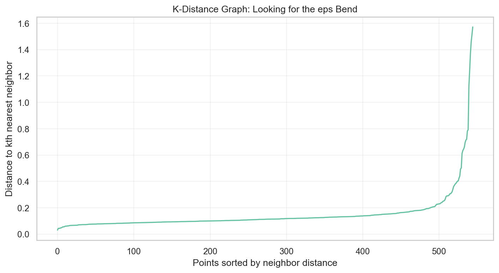
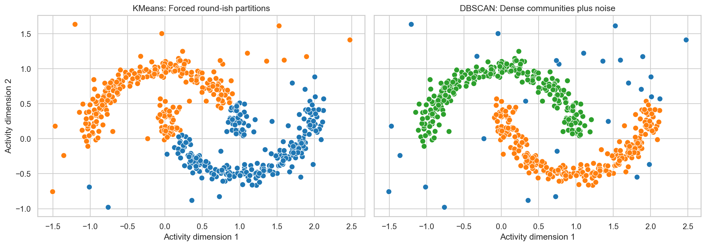

# How Machines Discover Hidden Communities in Chaotic Data - DBSCAN Explained Intuitively

## What if your data isn't made of neat circles... and your ML model needs to discover natural groups instead of forcing them?

Some data refuses to behave.

It does not form clean circles. It does not gather around tidy centers. It bends into curves, stretches into strange shapes, leaves gaps, creates islands, and throws rare points into empty space.

That is real-world data.

And this is where DBSCAN becomes fascinating.

KMeans tries to assign every point to a cluster.

DBSCAN asks a different question:

> Where is the data actually dense?

It does not force structure. It discovers dense communities and leaves isolated points alone.

That is why DBSCAN feels so different.

## Why Real-World Data Is Messy

Fraud does not always sit in a neat circle.

Geographic activity does not always form compact blobs.

Customer behavior does not always split into clean groups.

Network intrusions may appear as strange sparse bursts.

Real data has density, gaps, noise, and irregular shapes.

If we force that data into round clusters, we may erase the very pattern we need to understand.

DBSCAN exists because some structures are not center-based. They are density-based.

## Why KMeans Sometimes Fails

KMeans is useful, but it has assumptions.

It wants a fixed number of clusters.

It assigns every point to a cluster.

It works best when clusters are compact and roughly round.

But imagine a crowd at a street festival. People gather along curved streets, around food trucks, in pockets near music stages, and in sparse quiet corners.

Drawing two circles around that festival may not describe the crowd.

It may cut through natural communities and pull isolated people into groups where they do not belong.

That is what KMeans can do with irregular data.

## The Idea Behind Density-Based Clustering

DBSCAN sees the world through density.

Dense places become clusters.

Sparse places become empty space.

Isolated points become noise.

Think of a city map.

Downtown is dense. Suburbs are spread out. A lonely cabin far away is not part of the city just because it is closest to downtown.

DBSCAN respects that.

It lets the data decide where communities exist.

## Core Points, Border Points, and Noise

DBSCAN has three point types.

A core point lives in a dense neighborhood. It has enough neighbors nearby.

A border point is near a dense neighborhood but does not have enough neighbors to be dense by itself.

A noise point is isolated. It does not belong to any dense community.

This is one of DBSCAN's most powerful ideas:

> Not every point deserves a cluster.

That sounds simple, but it changes everything.

## Understanding eps and minPts

DBSCAN has two main parameters.

`eps` is the neighborhood radius.

It answers:

> How far can a point look for neighbors?

`min_samples` is the density requirement.

It answers:

> How many neighbors are enough to count as a dense place?

If eps is too small, DBSCAN becomes too strict. Many points become noise.

If eps is too large, separate groups can melt together.

The k-distance graph helps us choose eps by showing where neighbor distances begin to rise sharply.

## Why DBSCAN Feels More Natural

DBSCAN feels natural because it follows the data's shape.

It can trace curved groups.

It can ignore isolated points.

It can discover clusters without asking us to choose K first.

This makes it feel less like forcing customers into rooms and more like watching communities emerge.

The data itself becomes the guide.

## Outlier Detection

Noise points are not failures.

They are often the most interesting points.

In fraud detection, unusual behavior may matter more than normal behavior.

In cybersecurity, isolated traffic patterns may reveal intrusion attempts.

In healthcare, rare measurements may signal edge cases.

In customer analytics, unusual activity may reveal bots, abuse, VIP behavior, or data quality problems.

DBSCAN gives us these points directly.

That is why it is useful not only for clustering, but also for anomaly detection.

## Comparing DBSCAN vs KMeans

The difference becomes obvious visually.

KMeans cuts the space into center-based partitions.

DBSCAN follows dense shapes and leaves noise alone.

KMeans asks:

> Which center is closest?

DBSCAN asks:

> Is this point part of a dense neighborhood?

Those are very different questions.

## Real-World Applications

DBSCAN is useful when shape and noise matter.

Fraud teams can use it to identify suspicious behavior far from normal activity.

Geospatial teams can use it to find hotspots.

Cybersecurity teams can use it to isolate strange traffic.

Healthcare teams can use it to find unusual patient patterns.

Customer teams can use it to discover dense behavior communities and rare customer actions.

The common thread is messy data.

## Final Takeaway

DBSCAN is powerful because it does not force every point to belong.

It lets dense communities form naturally.

It treats isolation as information.

And in real-world data, that matters.

Sometimes the most important discovery is not only the cluster.

Sometimes it is the point that does not belong.

GitHub repo placeholder: `[Add GitHub link here]`

Companion interview article placeholder: `[Add Medium interview article link here]`

