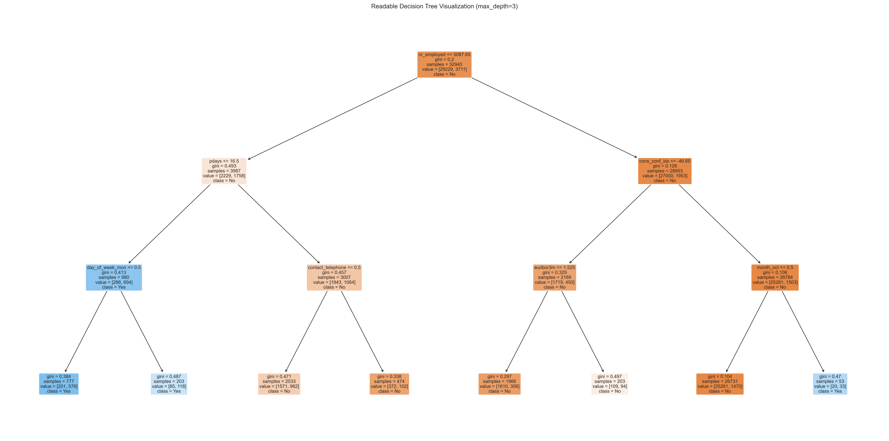
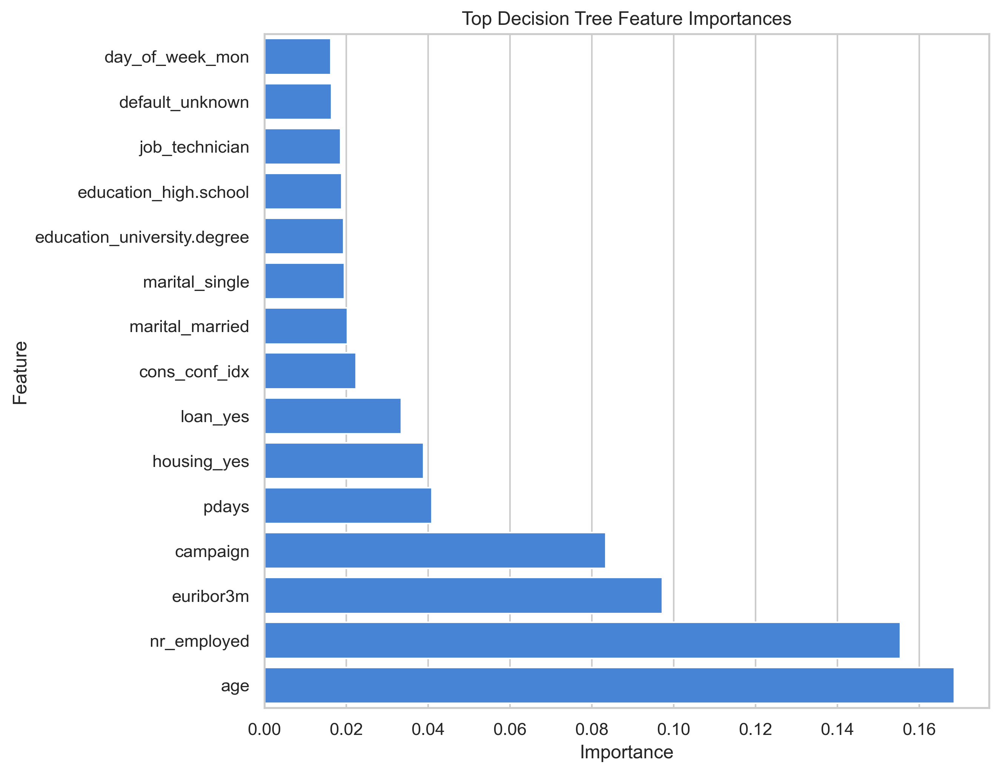

# Decision Trees Interview Questions Explained Intuitively

Decision Trees are interview favorites because they look simple from the outside, but they quietly test a lot of machine learning judgment.

At first glance, a Decision Tree is just a flowchart.

Ask a question. Follow a branch. Reach a prediction.

But once an interviewer starts digging, that flowchart opens into deeper ideas:

- How does the model choose a split?
- What makes one split better than another?
- Why do trees overfit so easily?
- What is pruning?
- Why do Random Forests improve on single trees?
- How would you explain the model to a business stakeholder?

This article is a conversational guide to the Decision Tree questions you are most likely to see in interviews.

The goal is not to memorize textbook definitions.

The goal is to build answers that sound clear, practical, and human.



## 1. What is a Decision Tree?

A Decision Tree is a supervised machine learning model that makes predictions by asking a sequence of questions.

You can think of it like a flowchart learned from data.

For example, in a bank marketing project, the model might ask:

> Did the customer respond successfully to a previous campaign?

Then:

> Was the customer contacted many times during this campaign?

Then:

> What is the current economic context?

Each answer sends the customer down a different branch. Eventually, the customer reaches a leaf node, where the model makes its prediction.

A strong interview answer:

> A Decision Tree is a rule-based supervised learning model. It recursively splits the data into smaller groups based on feature values, then predicts using the majority class or average value in the final leaf node.

## 2. How does a Decision Tree make predictions?

A Decision Tree starts at the root node.

At each internal node, it checks a condition.

For example:

```text
previous_outcome_success <= 0.5
```

If the condition is true, the observation goes left.

If the condition is false, it goes right.

This continues until the observation reaches a leaf node.

For classification, the leaf usually predicts the majority class among the training examples that reached that leaf.

In plain English:

> The tree routes each observation through a series of learned rules until it reaches a final decision.

## 3. What is a root node?

The root node is the first node in the tree.

It contains the full training dataset before any splits have happened.

The first split is important because it usually captures one of the strongest ways to separate the target classes.

Interview-friendly phrasing:

> The root node is the starting point of the tree. It contains all training samples and is split into child nodes using the feature and threshold that best reduces impurity.

## 4. What is a leaf node?

A leaf node is an ending point.

No more splits happen after a leaf.

In a classification tree, the leaf stores the predicted class and often class probabilities.

For example, a leaf may contain:

```text
90% no subscription
10% subscription
```

The predicted class would be `no subscription`.

## 5. What is a split?

A split is a question that divides the data into groups.

In scikit-learn Decision Trees, splits are binary. That means each split sends observations in one of two directions.

Examples:

```text
age <= 35
campaign_contacts <= 2
poutcome_success <= 0.5
```

The model searches across features and thresholds to find the split that creates the cleanest child nodes.

## 6. What is Gini impurity?

Gini impurity measures how mixed the classes are inside a node.

Imagine a box of customer records.

If every customer in the box subscribed, the box is pure.

If no customer in the box subscribed, the box is also pure.

If the box contains a mix of subscribers and non-subscribers, the box is impure.

Gini impurity gives us a number for that messiness.

The Decision Tree tries to reduce Gini impurity with each split.

Simple interview answer:

> Gini impurity measures the probability of incorrectly classifying a randomly chosen sample if it were labeled according to the class distribution in that node. Lower Gini means a purer node.

Beginner-friendly version:

> Gini tells us how mixed a node is. The tree prefers splits that make the child nodes less mixed.

## 7. What is entropy?

Entropy is another impurity measure.

It measures uncertainty or disorder.

If a node has a balanced mix of classes, entropy is high because the model is uncertain.

If a node contains only one class, entropy is zero because there is no uncertainty.

Plain-English answer:

> Entropy measures how uncertain the node is. The more mixed the classes are, the higher the entropy.

## 8. What is information gain?

Information gain measures how much uncertainty is reduced after a split.

If entropy tells us how uncertain we are before and after a split, information gain tells us how much better the split made things.

The formula idea is:

```text
information gain = parent uncertainty - weighted child uncertainty
```

In human language:

> A good split teaches the model something. Information gain measures how much it learned from that split.

## 9. What is the difference between Gini and entropy?

Both Gini and entropy measure impurity.

Both help the tree choose splits.

The difference is mostly mathematical.

Gini is slightly simpler and faster to compute. Entropy comes from information theory and is used with information gain.

In many real projects, they produce similar trees.

A clean interview answer:

> Gini and entropy are both criteria for measuring node impurity. Gini is computationally simpler and is the default in scikit-learn, while entropy is based on information gain. Their practical results are often similar, so the choice usually matters less than controlling overfitting.

That last sentence is useful because it shows judgment.

## 10. Why do Decision Trees overfit?

Decision Trees overfit because they can keep splitting the data into smaller and smaller groups.

If the tree is allowed to grow without limits, it may create rules that describe tiny quirks in the training set.

For example:

> Customers with this exact combination of features subscribed in the training data, so predict subscription.

That rule may not hold for future customers.

This is the classic problem:

> The tree memorizes training examples instead of learning general patterns.

Strong interview answer:

> Decision Trees overfit because they are high-variance models. Without constraints, they can keep splitting until leaves are very small or pure, which captures noise in the training data and hurts generalization.

## 11. How do you control overfitting in Decision Trees?

You control overfitting by limiting how complex the tree can become.

Common methods:

- reduce `max_depth`
- increase `min_samples_split`
- increase `min_samples_leaf`
- use `max_leaf_nodes`
- use cost-complexity pruning with `ccp_alpha`
- validate with cross-validation
- use ensembles such as Random Forest

Good practical answer:

> I would tune tree complexity using cross-validation. I would start with `max_depth`, `min_samples_leaf`, and `min_samples_split`, then compare train and validation performance to make sure the model is not just memorizing the training set.

## 12. What is max_depth?

`max_depth` controls how many levels the tree can grow.

A small `max_depth` creates a simpler tree.

A large `max_depth` allows more complex rules.

Too small can underfit.

Too large can overfit.

Simple answer:

> `max_depth` limits the depth of the tree and helps control model complexity.

## 13. What is min_samples_split?

`min_samples_split` is the minimum number of samples required for a node to be split.

If `min_samples_split=100`, a node must contain at least 100 samples before the model is allowed to split it.

This prevents the tree from making decisions based on tiny groups.

## 14. What is min_samples_leaf?

`min_samples_leaf` controls the minimum number of samples allowed in a final leaf node.

This is one of the most useful tree parameters.

Why?

Because it stops the tree from creating leaves with only one or two observations.

Those tiny leaves often represent memorization.

Interview answer:

> `min_samples_leaf` makes the final decision groups larger, which smooths the model and often improves generalization.

## 15. What is pruning?

Pruning means simplifying a tree by removing branches that do not add enough value.

There are two broad ideas:

- pre-pruning
- post-pruning

Pre-pruning stops the tree early using parameters like `max_depth` or `min_samples_leaf`.

Post-pruning grows a tree first, then removes weak branches.

In scikit-learn, cost-complexity pruning uses `ccp_alpha`.

Higher `ccp_alpha` means stronger pruning.

Conversational answer:

> Pruning is like editing a tree after it gets too detailed. We remove branches that make the model more complex without improving generalization.

## 16. Do Decision Trees need feature scaling?

No.

Decision Trees do not need feature scaling because they split using thresholds.

For example:

```text
age <= 35
income <= 50000
```

The model does not calculate distances between observations.

So scaling is not required in the same way it is for Logistic Regression, KNN, SVM, or neural networks.

Interview answer:

> Decision Trees generally do not need feature scaling because splits are based on feature order and thresholds, not distance or gradient magnitude.

## 17. Can Decision Trees handle categorical variables?

Conceptually, yes.

Decision Trees are very natural for categorical logic.

For example:

```text
contact_type = cellular
job = technician
education = university_degree
```

But scikit-learn's Decision Tree implementation expects numerical input.

So in Python, we usually encode categorical variables first.

Common options:

- one-hot encoding
- ordinal encoding
- target encoding, with care

For nominal categories, one-hot encoding is usually safer because it does not invent an artificial order.

## 18. How do you interpret feature importance?

Feature importance tells us which features helped the tree reduce impurity the most.



If a feature has high importance, it means the tree used it in useful splits.

But there is an important warning:

> Feature importance is not causation.

If `poutcome_success` is important in a bank marketing model, that does not mean we can magically change a previous campaign outcome. It means the feature is useful for prediction.

Strong answer:

> Decision Tree feature importance measures the total reduction in impurity contributed by each feature. It is helpful for interpretation, but it can be biased and should not be treated as causal evidence.

## 19. How would you explain a Decision Tree to a non-technical stakeholder?

I would say:

> A Decision Tree is like a structured checklist. It asks a series of questions about a customer and uses the answers to reach a prediction.

Then I would give an example:

> For a marketing campaign, it might first ask whether the customer responded to a previous campaign, then whether they were contacted recently, then whether current economic indicators look favorable.

This makes the model less abstract.

Stakeholders do not need the formula first. They need the mental picture first.

## 20. Why are Decision Trees useful in business?

Decision Trees are useful in business because they are explainable.

Many business teams want to know not only what the model predicted, but also why.

Decision Trees can help with:

- customer targeting
- risk segmentation
- operational decision rules
- churn prediction
- loan default screening
- campaign prioritization

They are especially useful when the model has to be discussed with people who are not machine learning specialists.

## 21. What are the risks of using Decision Trees in business?

The main risks are:

- overfitting
- instability
- oversimplified rules
- misleading feature importance
- poor performance compared with ensembles
- sharp thresholds that may not match real human behavior

For example, a tree might split at:

```text
age <= 41.5
```

That does not mean a 41-year-old and a 42-year-old are meaningfully different people. It means the split helped the model separate the training data.

That distinction matters.

## 22. When would you avoid a single Decision Tree?

I would avoid a single Decision Tree when predictive performance and stability matter more than simple interpretability.

For example:

- fraud detection at scale
- high-stakes credit decisions
- noisy behavioral data
- medical risk prediction
- production systems where small model changes create operational issues

In those cases, I might use Random Forest, Gradient Boosting, Logistic Regression, or another model depending on the constraints.

## 23. Decision Trees vs Logistic Regression

Logistic Regression and Decision Trees are both common classification models, but they think very differently.

Logistic Regression learns a weighted equation.

It is excellent when you want:

- stable coefficients
- probability estimates
- linear interpretability
- a strong baseline

Decision Trees learn rule-based splits.

They are useful when you want:

- nonlinear patterns
- visual explanation
- feature interactions without manually creating them
- business-rule style interpretation

A simple comparison:

```text
Logistic Regression asks: how much does each feature push the probability up or down?

Decision Trees ask: what sequence of questions separates the classes?
```

Logistic Regression is often more stable.

Decision Trees are often easier to explain visually.

## 24. Decision Trees vs Random Forest

A Random Forest is an ensemble of many Decision Trees.

Instead of trusting one tree, it trains many trees on different samples and feature subsets, then combines their predictions.

Why does this help?

Because single trees are unstable.

One tree might overreact to patterns in the training data. Many trees averaged together are usually more reliable.

The tradeoff:

- single tree: easier to explain
- random forest: usually better performance and stability

Interview answer:

> A Random Forest reduces the variance of a single Decision Tree by averaging many trees trained with randomness. It usually improves accuracy and robustness, but sacrifices some interpretability.

## 25. When should you use Decision Trees vs ensembles?

Use a single Decision Tree when:

- interpretability is the top priority
- you need a simple baseline
- you are teaching the concept
- stakeholders want readable rules
- the model will support discussion rather than automate everything

Use ensembles when:

- performance matters more
- the dataset is noisy
- a single tree is unstable
- you can tolerate reduced transparency
- production accuracy is more important than a simple diagram

In practice, a strong workflow might be:

1. Start with Logistic Regression as a linear baseline.
2. Train a Decision Tree for rule-based intuition.
3. Try Random Forest or Gradient Boosting for stronger performance.
4. Compare models using metrics and business context.

## 26. How do you evaluate a Decision Tree classifier?

Use the same classification metrics you would use for other classifiers:

- accuracy
- precision
- recall
- F1-score
- confusion matrix
- ROC-AUC for binary classification

But choose metrics based on the business problem.

For a marketing campaign:

- precision matters if outreach is expensive
- recall matters if missing likely responders is costly
- ROC-AUC matters if the team wants to rank customers

Accuracy alone is often not enough, especially when the classes are imbalanced.

## 27. What is a good final interview answer about Decision Trees?

Here is a strong summary:

> A Decision Tree is an interpretable supervised model that recursively splits data using feature-based rules. It chooses splits by reducing impurity, using criteria such as Gini impurity or entropy. Decision Trees are easy to visualize and can capture nonlinear relationships, but they overfit easily if not regularized. Parameters like `max_depth`, `min_samples_split`, `min_samples_leaf`, and pruning help control complexity. In business, they are useful when explanation matters, but for stronger predictive performance we often compare them with ensembles like Random Forest.

That answer covers:

- definition
- split logic
- impurity
- interpretability
- overfitting
- regularization
- business use
- comparison with ensembles

That is the sweet spot.

## Final Takeaway

Decision Trees are simple enough to explain with a flowchart, but deep enough to teach real machine learning judgment.

They show us how models split data.

They show us why overfitting matters.

They show us how interpretability and performance can pull in different directions.

If you can explain Gini, entropy, pruning, feature importance, and overfitting in plain language, you are not just memorizing interview answers.

You are starting to think like a machine learning practitioner.
