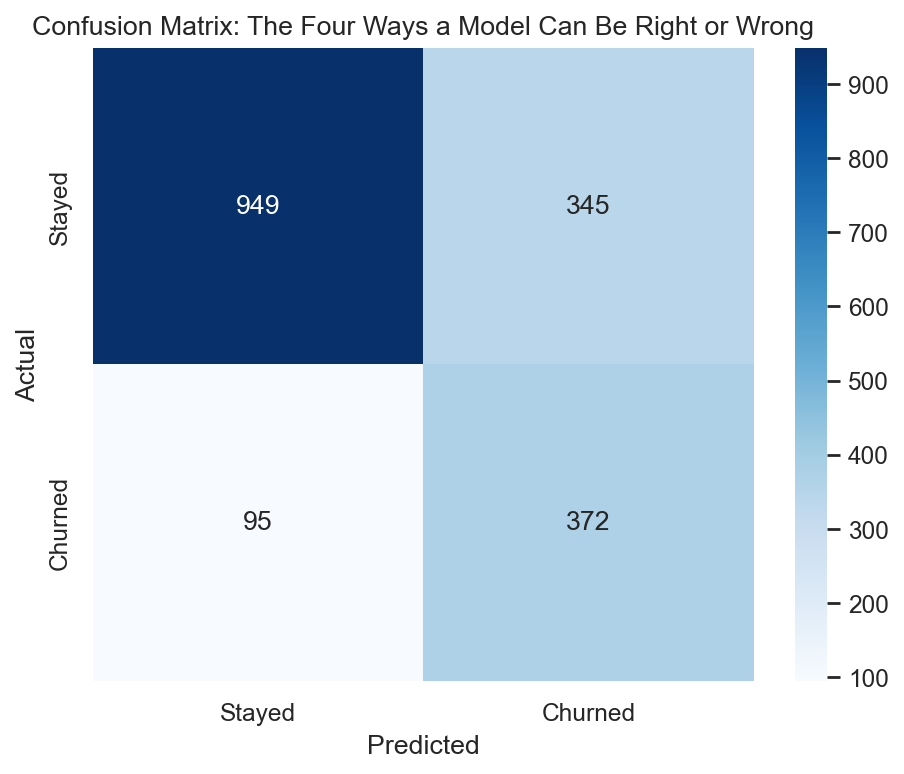
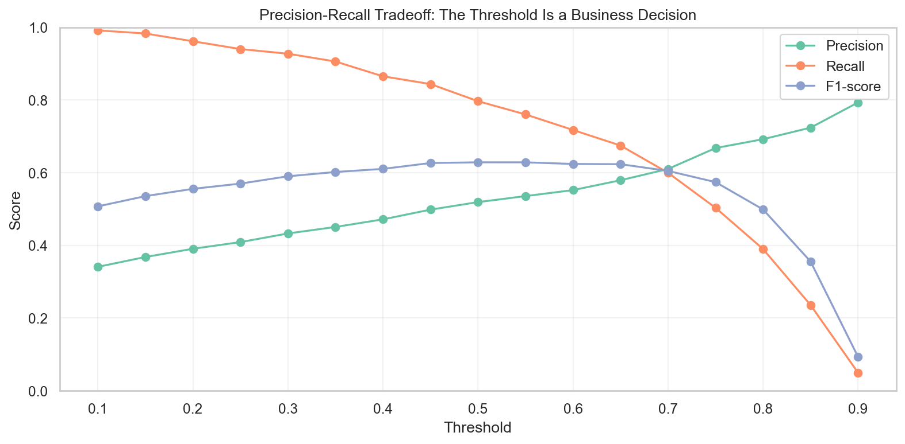
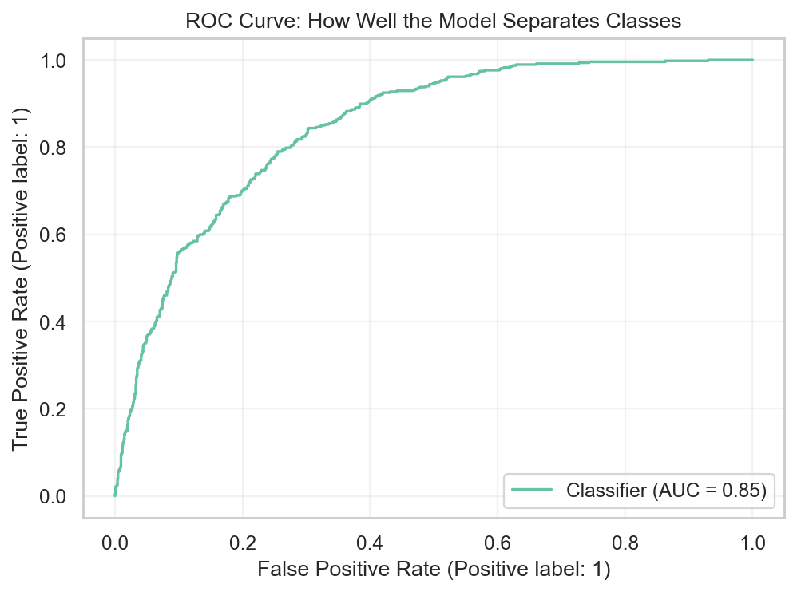
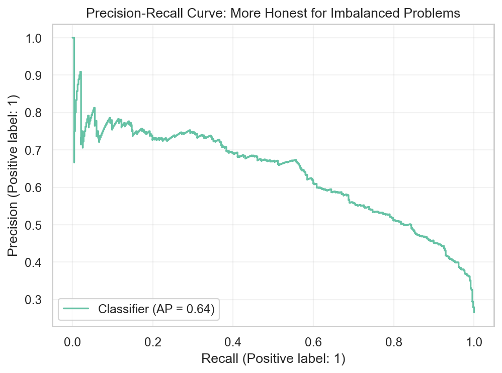

# Why 99% Accuracy Can Still Mean Your ML Model Is Terrible - Evaluation Metrics Explained Intuitively

## The hidden reason many machine learning models fail in the real world despite looking "accurate"

There is a number that can make a machine learning project feel safe.

Accuracy: 99%.

It looks clean. It looks impressive. It looks like success.

But sometimes that number is not success at all.

Sometimes it is a mask.

Imagine a fraud detection system where 99% of transactions are legitimate and 1% are fraud. A model that predicts "not fraud" for every transaction gets 99% accuracy.

It also catches zero fraud.

That is the accuracy trap.

The model looks right because the world is imbalanced. But it completely fails the reason it exists.

This is why evaluation metrics matter. They are not just formulas. They are how we ask whether a model is actually useful.

> A model can look accurate and still completely fail in the real world.

## The Accuracy Trap

Accuracy answers one question:

> How often was the model right overall?

That is a useful question when the classes are balanced and mistakes cost roughly the same.

But many real problems are not like that.

Fraud is rare. Disease can be rare. Customer churn may be less common than customer retention. Conversions may be a tiny fraction of visitors.

In those cases, a model can perform well overall by ignoring the rare class.

That is dangerous because the rare class is often the class we care about most.

In fraud detection, the rare class is fraud.

In medical screening, the rare class may be disease.

In churn prediction, the smaller class may be customers who leave.

Accuracy can tell you the model was right most of the time while hiding the fact that it failed exactly where it mattered.

## Why Metrics Exist

Metrics exist because not all mistakes are equal.

A false alarm and a missed emergency are both errors, but they do not feel the same.

If a spam filter marks a newsletter as spam, maybe that is acceptable. If it hides an important job offer or hospital message, that is much worse.

If a churn model flags a loyal customer as high risk, the business might waste a discount. If it misses a customer who was about to leave, the business may lose months or years of revenue.

Evaluation metrics are a language for describing these tradeoffs.

They help us ask:

- What kind of mistake is the model making?
- How often does that mistake happen?
- Which mistake costs more?
- Is the model useful for the decision we need to make?

## Understanding the Confusion Matrix

The confusion matrix is where model evaluation becomes concrete.

It shows four outcomes:

- True Positive: the model predicted the positive class, and it was right
- True Negative: the model predicted the negative class, and it was right
- False Positive: the model predicted positive, but it was wrong
- False Negative: the model predicted negative, but it was wrong

In churn prediction:

True positive means the model correctly identified a customer who churned.

True negative means the model correctly identified a customer who stayed.

False positive means the model flagged a customer as churn risk even though they stayed.

False negative means the model missed a customer who actually churned.

That final category often hurts the most. It is the customer who left while the model stayed silent.

## Precision Explained

Precision asks:

> When the model says positive, how often is it right?

In churn prediction:

> When the model says a customer is at risk, how often is that customer actually at risk?

Precision matters when action is expensive.

If a company has a limited retention budget, it cannot offer discounts to everyone. A low-precision model may flood the team with false alarms.

In spam filtering, precision is also crucial. If the system says an email is spam, it should usually be spam. False positives can hide important messages.

Precision is about trust in the model's alerts.

## Recall Explained

Recall asks:

> Of all the actual positive cases, how many did the model catch?

In churn prediction:

> Of all customers who actually left, how many did we identify before they left?

Recall matters when missed positives are costly.

In cancer detection, missing a positive case can change someone's life. In fraud detection, missed fraud can become direct financial loss. In churn, missed churners represent customers the company never tried to save.

Recall is the metric of catching what matters.

It is emotionally different from precision because false negatives are silent. They do not show up as noisy alerts. They disappear quietly until the damage is done.

## The Precision vs Recall Tradeoff

Precision and recall often move against each other.

Most classification models produce probabilities. A threshold turns those probabilities into decisions.

At threshold 0.5, we predict positive when the model says the probability is at least 50%.

But 0.5 is not magic.

If we lower the threshold, the model becomes more aggressive. It catches more positives, so recall usually rises. But it also creates more false positives, so precision may fall.

If we raise the threshold, the model becomes more cautious. Precision may rise, but recall may fall.

This is where metrics become business strategy.

A fraud team may prefer high recall because missing fraud is expensive.

A retention team with limited budget may prefer higher precision because outreach is costly.

There is no universal best threshold. There is only a threshold that matches the business decision.

## F1-Score

F1-score balances precision and recall.

It is useful when both false positives and false negatives matter.

The intuition is simple: F1 does not let the model hide behind one strong metric while failing the other.

A model with excellent precision but terrible recall misses too much.

A model with excellent recall but terrible precision creates too many false alarms.

F1 rewards balance.

## ROC Curves

The ROC curve shows how the true positive rate changes against the false positive rate across thresholds.

True positive rate is recall.

False positive rate measures how often negative cases are incorrectly flagged.

ROC-AUC summarizes the curve into one number. It tells us how well the model ranks positives above negatives.

A useful mental model:

> If we randomly choose one churned customer and one customer who stayed, how often does the model give the churned customer a higher risk score?

That is the ranking intuition behind AUC.

## PR Curves

Precision-Recall curves are often more useful for imbalanced datasets.

They focus directly on the positive class.

In churn prediction, that means the customers who actually leave. In fraud detection, that means fraudulent transactions. In medical screening, that means positive cases.

ROC curves can sometimes look strong even when positive-class performance is not operationally good. PR curves make the tradeoff harder to ignore.

They ask:

> As we try to catch more positives, how much precision do we lose?

## Threshold Tuning

Threshold tuning is one of the most practical parts of model evaluation.

The model gives probabilities. The business needs decisions.

Those decisions require a cutoff.

If the churn model flags too many customers, the retention team may not have enough capacity. If it flags too few, the company may miss customers it could have saved.

Threshold tuning lets us choose behavior:

- aggressive model: more recall, more false positives
- cautious model: more precision, more false negatives
- balanced model: compromise between the two

The right threshold depends on budget, risk, staffing, and customer value.

## Business Tradeoffs

Different problems need different metrics.

Fraud detection often prioritizes recall because missed fraud is expensive.

Spam filtering often prioritizes precision because hiding legitimate email damages trust.

Medical screening often prioritizes recall because missing disease can be dangerous.

Recommendation systems often use ranking metrics because the order of suggestions matters.

Regression problems use metrics like MAE, RMSE, and R2 because predictions are continuous.

The metric should match the consequence.

## Choosing the Right Metric

Before choosing a model, choose the evaluation question.

Ask:

- Is the positive class rare?
- Which mistake is more expensive?
- Do we care about ranking or hard decisions?
- Is there an operational capacity limit?
- Do we need probability calibration?
- Will the threshold be tuned?

Only then should metrics be chosen.

This is how real ML teams avoid building models that look good in notebooks and fail in production.

## Final Takeaway

Evaluation metrics are not a scoreboard.

They are a decision language.

Accuracy tells one part of the story. Precision, recall, F1-score, ROC-AUC, PR curves, and threshold tuning reveal the rest.

The real skill is not memorizing formulas.

The real skill is knowing which mistakes matter.

GitHub repo placeholder: `[Add GitHub link here]`

Companion interview article placeholder: `[Add Medium interview article link here]`

