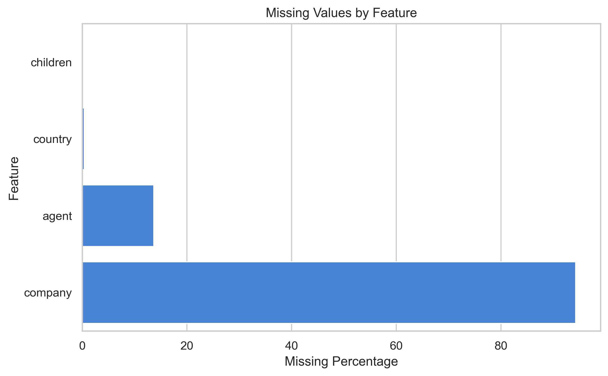
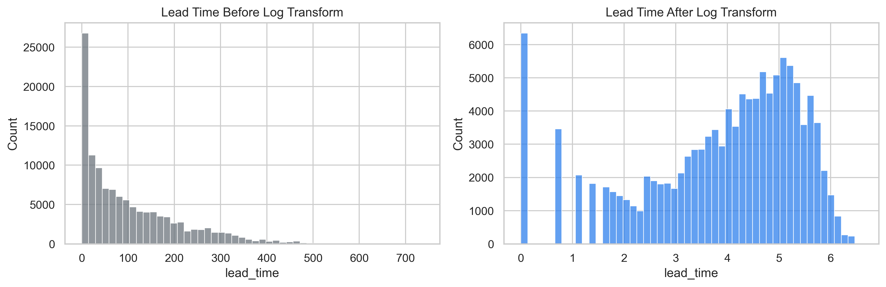
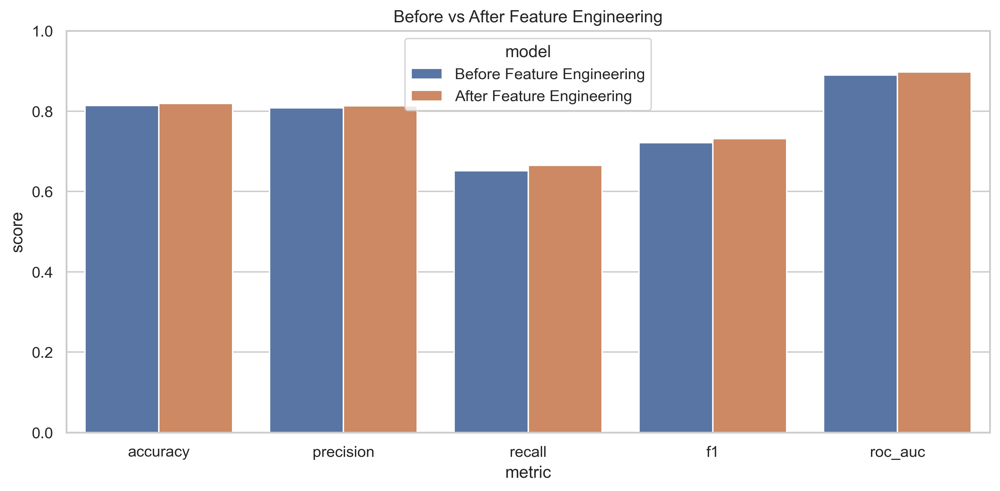
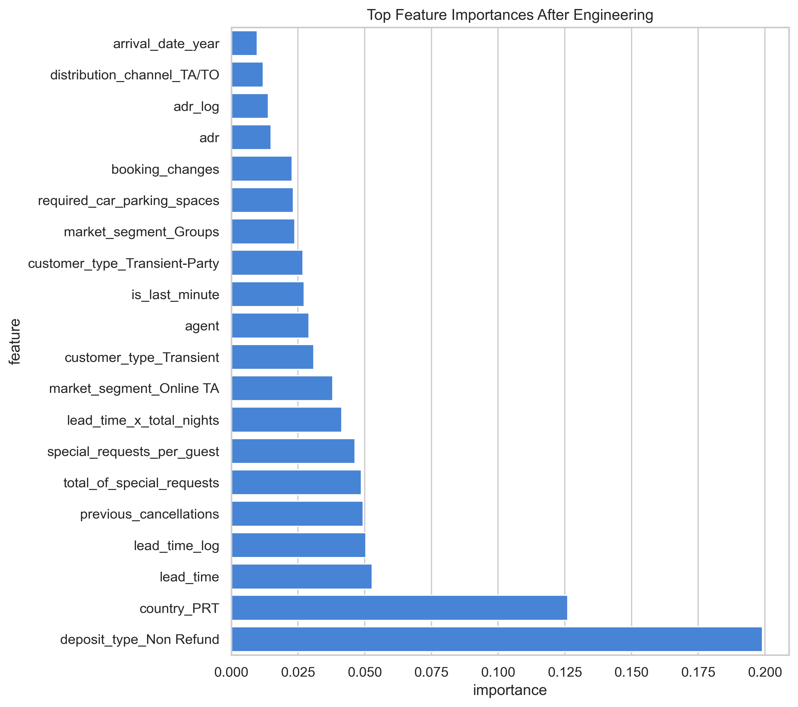

# The Secret Sauce Behind Great ML Models — Feature Engineering Explained Intuitively

Subtitle: Why better features often matter more than better algorithms

Machine learning beginners often fall in love with algorithms first.

Logistic Regression. Random Forest. XGBoost. Neural networks.

The names sound powerful, and they are.

But ask someone who has built models on real business data, and you will hear a quieter truth:

> The biggest improvement often does not come from changing the algorithm. It comes from changing what the algorithm gets to see.

That is feature engineering.

It is the hidden craft of turning messy reality into useful signal.

It is where data science stops feeling like button-clicking and starts feeling creative.

## Raw Data Is Rarely Enough

Raw data is not the same thing as useful data.

A hotel booking table may contain dates, room types, guest counts, prices, agents, companies, countries, deposits, and cancellation status.

Technically, those are columns.

But a model does not automatically understand the business meaning inside them.

It does not know that a booking made 200 days in advance may behave differently from a booking made yesterday.

It does not know that a family booking may behave differently from a solo traveler.

It does not know that a missing company value may mean "not a corporate booking" rather than "data broken."

Feature engineering is how we translate those ideas.

Raw data is like ingredients on a kitchen counter.

Feature engineering is the cooking.

## The Project Story

In this project, we predict hotel booking cancellations.

The business question is:

> Can we identify bookings that are likely to be canceled?

This matters because cancellations affect revenue, staffing, room inventory, pricing strategy, and operational planning.

If a hotel expects a room to be occupied and it gets canceled late, that room may go unsold.

If the hotel can estimate cancellation risk earlier, it can make smarter decisions.

That does not mean the model replaces hotel managers.

It gives them sharper visibility.

## Missing Values Are Not Just Empty Cells

Missing values look boring at first.

They feel like cleanup.

But missingness can carry meaning.



In this dataset, `company` has many missing values. A naive approach might say:

> This column is mostly empty. Drop it.

But a missing company can mean the booking was not made through a company.

That is a signal.

The same idea applies to `agent`. Missing agent may mean there was no travel agent involved.

So instead of treating every blank as a nuisance, we ask:

> What does this missing value mean in the real world?

That question is the beginning of feature engineering.

## Encoding: Translating Categories Into Model Language

Models do not understand text categories like humans do.

A model cannot naturally interpret:

- `City Hotel`
- `Resort Hotel`
- `Online TA`
- `No Deposit`
- `Transient`

To the model, those are just strings.

One-hot encoding turns each category into a switch.

For example:

```text
hotel_City Hotel = 1
deposit_type_Non Refund = 0
market_segment_Online TA = 1
```

Now the model can learn from those signals.

But encoding is not just a mechanical step. It changes what relationships are visible to the model.

If the model can see that online travel agency bookings cancel differently from direct bookings, it has gained business awareness.

## Scaling: Giving Optimization a Fair Playing Field

Some models care deeply about scale.

Logistic Regression, KNN, SVM, PCA, and neural networks can be affected when one feature has values in the thousands and another feature has values between 0 and 1.

Scaling helps put numerical features on a comparable footing.

Think of it like asking people to compare height in centimeters, income in dollars, and age in years.

The units are not equally sized.

The model may give too much attention to the feature with the biggest numerical range, not because it is more meaningful, but because it is louder.

Scaling quiets the room.

Tree models are different. Decision Trees, Random Forests, and many boosting models split on thresholds, so they usually do not need scaling.

That is why feature engineering is not one-size-fits-all.

The right transformation depends on the model.

## Log Transformations: Taming Long Tails

Business data is often skewed.

Lead time is a great example.

Many bookings happen within a reasonable window. A smaller number happen extremely far in advance.

Those extreme values create a long tail.



A log transformation compresses large values.

It does not delete outliers.

It makes them less overpowering.

This helps models see the broader pattern instead of being pulled around by a small number of extreme cases.

In plain English:

> Log transforms turn shouting into speaking.

## Feature Creation Is Where Data Science Gets Creative

This is the exciting part.

Raw columns tell us facts.

Engineered features tell us meaning.

In the hotel booking dataset, the raw data has:

- weekend nights
- week nights
- adults
- children
- babies
- lead time
- average daily rate
- special requests
- parking spaces

Those are useful, but they are not the whole story.

So we create features like:

- `total_nights`
- `total_guests`
- `weekend_share`
- `adr_per_guest`
- `special_requests_per_guest`
- `is_last_minute`
- `is_long_stay`
- `arrival_day_of_week`
- `arrival_quarter`
- `season`
- `lead_time_x_total_nights`

Each one is a small business hypothesis.

Maybe long stays cancel differently.

Maybe bookings with special requests are more committed.

Maybe last-minute bookings behave differently from bookings made months in advance.

Maybe the same price means something different for one guest versus four guests.

Feature engineering is how we hand those hypotheses to the model.

## Derived Features Reveal Hidden Signal

The feature `adr` tells us average daily rate.

But `adr_per_guest` tells a more specific story:

> How expensive is this booking per person?

The feature `stays_in_weekend_nights` tells us weekend nights.

But `weekend_share` tells us:

> Is this trip mostly a weekend stay or mostly a weekday stay?

The feature `lead_time` tells us how far in advance the booking was made.

But `lead_time_x_total_nights` asks:

> Is this a long trip planned far ahead?

That is the magic of derived features.

They let the model see relationships that are not obvious from raw columns alone.

## Target Leakage: The Dangerous Shortcut

Target leakage is one of the most dangerous problems in machine learning.

It happens when the model sees information that would not be available at prediction time.

In this dataset, `reservation_status` is dangerous.

If the reservation status says `Canceled`, the model does not need to learn.

It already knows the answer.

`reservation_status_date` is also dangerous because it is tied to the outcome timeline.

If we include leaky features, the model may look brilliant in the notebook.

But it is not brilliant.

It is cheating.

Leakage creates fake confidence.

A real machine learning practitioner constantly asks:

> Would this feature exist at the moment I need to make the prediction?

If the answer is no, the feature does not belong in the model.

## Feature Selection: Less Can Be Smarter

After one-hot encoding and feature creation, the dataset can grow quickly.

More features are not always better.

Some features are noisy.

Some are redundant.

Some add complexity without adding signal.

Feature selection helps the model focus.

In this project, we use mutual information to select useful features for the improved model.

The point is not to blindly remove columns.

The point is to reduce noise and help the model concentrate on stronger signals.

## PCA: Compressing the Feature Space

PCA can sound intimidating, but the intuition is friendly.

Imagine your data as a cloud of points.

PCA rotates your view until it finds the directions where the data spreads out the most.

It compresses many columns into fewer directions while trying to preserve as much information as possible.

In this project, PCA is introduced visually and intuitively, not as a heavy math detour.

The lesson is simple:

> Sometimes we can compress features while preserving signal.

## Before vs After Feature Engineering

This is the heart of the project.

We train a Logistic Regression model before feature engineering.

Then we train the same kind of model after feature engineering.



The result:

```text
Before feature engineering
F1-score: 0.7218
ROC-AUC:  0.8899

After feature engineering
F1-score: 0.7330
ROC-AUC:  0.8979
```

The improvement is not because we switched to a fancy model.

We gave the model better information.

That is the whole point.

## Feature Importance

After training the improved model, we inspect which features carry strong signal.



Feature importance is not a final answer.

It is a conversation starter.

It tells us where the model found useful patterns, and it gives the business something to investigate.

Good practitioners do not say:

> This feature is important, so it causes cancellation.

They say:

> This feature helped prediction. Let us understand why.

## Final Takeaway

Feature engineering is where machine learning becomes creative.

It is where domain knowledge enters the model.

It is where messy reality becomes structured signal.

Algorithms matter.

But algorithms can only learn from the world we show them.

Better features give the model better eyesight.

And sometimes, that matters more than choosing a more complicated algorithm.

GitHub repo link: `[add GitHub link here]`

Companion interview article: `[add Medium interview article link here]`
