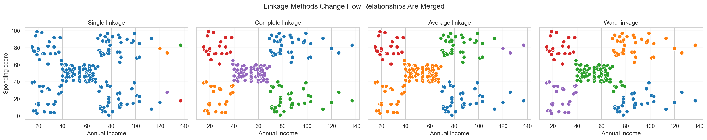
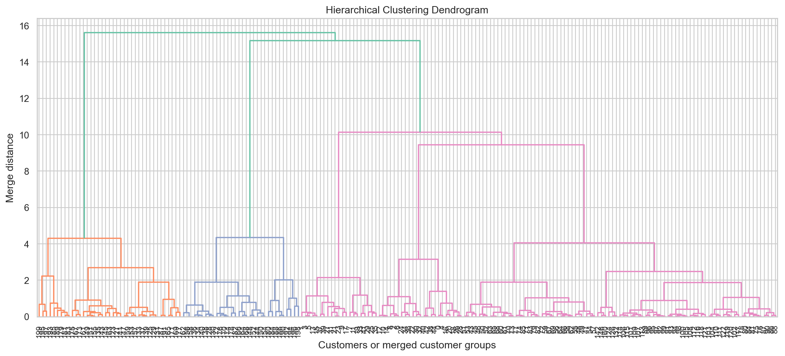
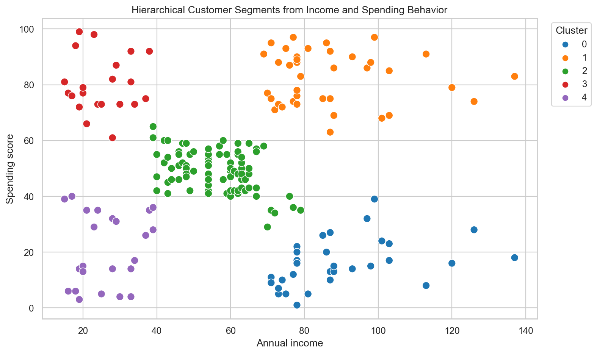

# How Machines Build Family Trees Inside Data - Hierarchical Clustering Explained Intuitively

## What if your data already contains hidden relationships... and your ML model can slowly uncover them layer by layer?

Some clustering algorithms feel like they are sorting data into boxes.

Hierarchical Clustering feels more like watching a family tree grow.

It starts with every data point alone. One customer. One behavior. One tiny island.

Then the closest two customers merge. Then another pair. Then small groups become larger groups. Slowly, the machine builds a tree of relationships.

Not just clusters.

Relationships.

That is what makes Hierarchical Clustering feel surprisingly human.

> It does not simply ask, "Which group does this point belong to?" It asks, "How are these points related?"

## The Hidden Relationships Inside Data

Data often contains relationships before anyone names them.

Customers may share spending habits. Products may share buying patterns. Documents may share themes. Patients may share symptoms. Communities may share behavior.

But those relationships are rarely labeled.

No one gives us a column called `customer_family_tree`.

Hierarchical Clustering tries to uncover that structure from similarity.

It lets us see how individual points become small groups, how small groups become larger groups, and how the whole dataset can be understood at multiple levels.

## Why Clustering Matters

Clustering matters because real-world data is often unlabeled.

Businesses may not know their customer segments in advance. A healthcare team may not know patient subtypes. A recommendation system may not know product communities.

Clustering gives us a way to discover groups without an answer key.

For customer segmentation, this can change strategy.

Instead of treating all customers the same, a business can understand premium customers, cautious spenders, promotion-sensitive shoppers, and everyday balanced customers.

That is not just technical insight.

It is business language emerging from data.

## KMeans vs Hierarchical Clustering

KMeans is fast, simple, and centroid-based.

It asks us to choose K upfront. Then it organizes points around K centers.

Hierarchical Clustering is different.

It builds relationships gradually.

KMeans asks:

> Where are the centers?

Hierarchical Clustering asks:

> How did the groups form?

That second question is why dendrograms are so powerful.

## Building Clusters Step-by-Step

Agglomerative Clustering is the bottom-up version of Hierarchical Clustering.

It begins with every point as its own cluster.

Then:

1. Find the two closest clusters.
2. Merge them.
3. Recalculate distances between groups.
4. Repeat.

At first, the merges are small and intimate. Two very similar customers join. Then another pair joins. Then small groups start merging into larger branches.

The algorithm creates a history.

That history is the hierarchy.

## Understanding Distance

Distance is the language of similarity.

If two customers have similar income and spending behavior, they are close. If one customer has high income and spends heavily while another has low income and spends cautiously, they are farther apart.

Euclidean distance is the straight-line distance.

Manhattan distance is like walking through city blocks.

Both are ways of asking:

> How behaviorally far apart are these points?

Because distance matters so much, scaling matters too.

If one feature has a much larger numeric range than another, it can dominate the relationship tree. Scaling makes the features speak at comparable volume.

## Linkage Methods

Linkage decides how groups judge distance between each other.

Single linkage says:

> Let the closest two members decide.

Complete linkage says:

> Let the farthest members decide.

Average linkage says:

> Look at the average relationship between the groups.

Ward linkage says:

> Merge in a way that keeps groups compact.

These choices matter because they change the personality of the clustering.

Single linkage can create long chains. Complete linkage tends to make tighter groups. Average linkage balances group-level similarity. Ward often creates compact, business-friendly clusters.

## The Magic of Dendrograms

The dendrogram is the family tree.

At the bottom, every point is alone.

As you move upward, points merge into groups. Groups merge into larger groups. The height of each merge shows how far apart the groups were when they joined.

This visual is what makes Hierarchical Clustering so interpretable.

You can see where relationships are close.

You can see where groups only merge at a large distance.

You can choose how detailed or broad your segmentation should be by cutting the tree at different heights.

## Choosing Clusters

Choosing clusters in Hierarchical Clustering means cutting the dendrogram.

Cut low, and you get many small groups.

Cut high, and you get fewer broad groups.

The best cut depends on both structure and purpose.

Silhouette scores can help by measuring how cohesive and separated clusters are. But business interpretation matters too.

A cluster solution is useful only if people can understand and act on it.

## Customer Segmentation

In the project, we use the Mall Customers dataset.

The key features are annual income and spending score.

The final model creates customer segments such as:

- premium high-value customers
- high-income cautious spenders
- budget enthusiastic shoppers
- low-income careful shoppers
- balanced everyday customers

The algorithm did not know those labels.

It built relationships.

Humans translated those relationships into strategy.

## PCA Visualization

When clustering uses multiple features, visualization gets harder.

PCA helps by compressing the feature space into two dimensions. It gives us a map of the cluster structure.

The map is not the full territory, but it helps us see whether groups look separated or tangled.

This matters because clustering is visual and interpretive. We need plots, profiles, and business context together.

## Real-World Applications

Hierarchical Clustering appears in many domains:

Biology uses it to build species and gene-expression trees.

Recommendation systems use it to group similar products or users.

Customer analytics uses it to discover market segments.

Document clustering uses it to organize themes.

Social network analysis uses it to find communities.

The common thread is relationship discovery.

## Final Takeaway

Hierarchical Clustering is powerful because it gives us more than labels.

It gives us a story.

It shows how data points become pairs, how pairs become groups, and how groups become a tree.

That is why dendrograms feel so human.

They let us watch relationships emerge.

GitHub repo placeholder: `[Add GitHub link here]`

Companion interview article placeholder: `[Add Medium interview article link here]`

