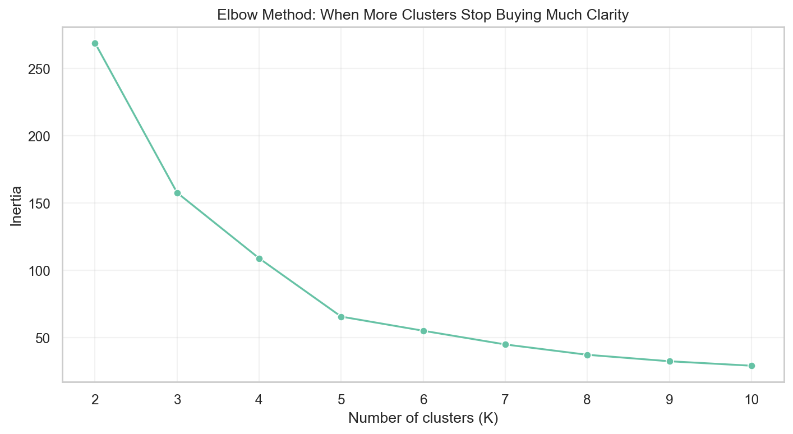
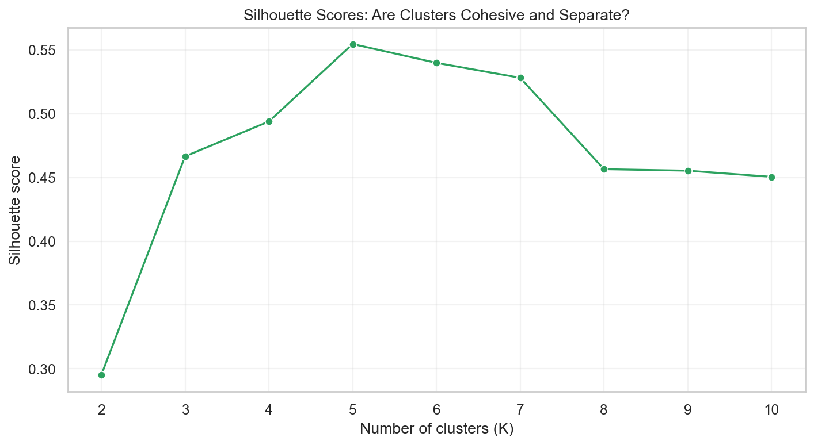
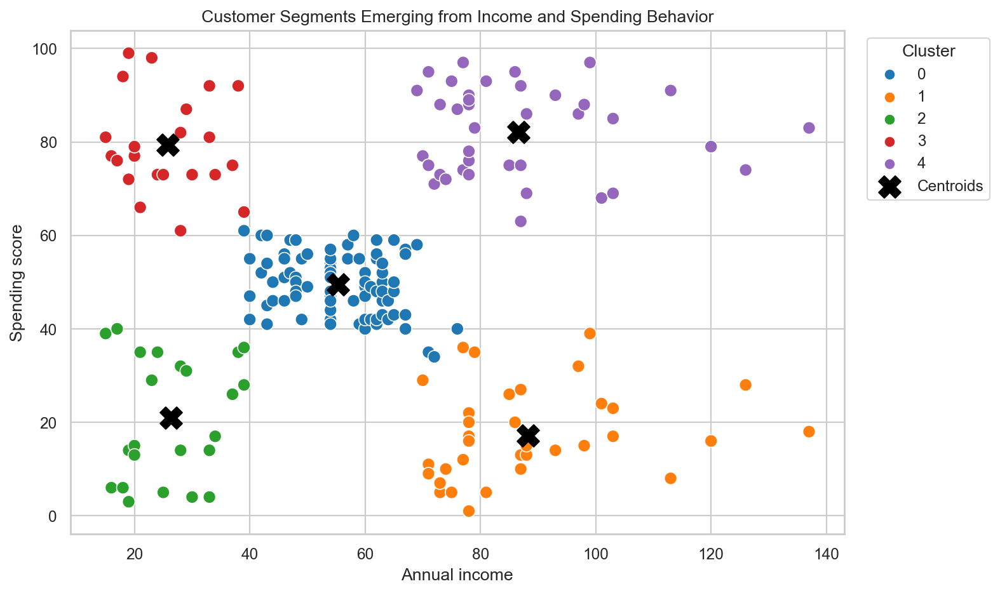

# How Machines Discover Hidden Groups in Data - KMeans Clustering Explained Intuitively

## What if your customer data already contains hidden patterns... and your ML model can uncover them automatically?

Most machine learning stories begin with labels.

This customer churned. This transaction was fraud. This house sold for that price.

The model learns from answers.

But some of the most interesting data in the world arrives without answers.

No one tells you which customers are premium shoppers. No one labels the cautious spenders. No one marks the bargain hunters, loyal explorers, or quiet high-value customers.

The patterns may already be there.

They are just unnamed.

That is the magic of clustering.

> Clustering asks a machine to discover structure before humans label it.

## The Magic of Unsupervised Learning

Unsupervised learning feels different from supervised learning.

In supervised learning, the model has a teacher. Every row has an answer. The model is corrected when it is wrong.

In unsupervised learning, there is no answer key.

The model walks into the data alone.

It must look for shape, similarity, distance, density, and structure. It must ask:

> Which things seem to belong together?

That question is simple, but powerful.

It is how we move from raw data to discovery.

## Why Hidden Patterns Matter

Businesses rarely serve one kind of customer.

A shopping mall might have teenagers with low income but high enthusiasm. It might have wealthy customers who spend freely. It might have wealthy customers who rarely spend. It might have everyday customers who behave steadily.

If the business treats everyone the same, it misses nuance.

Clustering helps create that nuance.

It can support:

- customer segmentation
- personalized marketing
- recommendation systems
- anomaly detection
- product strategy
- patient grouping
- financial behavior analysis

Clustering is not just about making colorful charts. It is about discovering groups that can guide better decisions.

## What Clustering Actually Means

Imagine a library after every book has been dumped onto the floor.

There are no shelves. No labels. No categories.

But as you look closer, patterns appear.

Cookbooks share recipes. Novels share storytelling. Travel guides share destinations. Textbooks share structure.

You start grouping books by similarity.

That is clustering.

Or imagine building music playlists from a messy song library. You notice songs that feel calm, energetic, acoustic, electronic, nostalgic, or danceable.

Nobody gave you the playlists.

You discovered them.

KMeans does something similar with numbers.

## The Idea Behind KMeans

KMeans is one of the most famous clustering algorithms because it is simple and visual.

You choose a number of clusters, called K.

Then KMeans places K centroids in the data space.

A centroid is the center of a cluster. Think of it like a magnet. Each data point looks for the nearest magnet and joins it.

Then each magnet moves toward the center of the points assigned to it.

The process repeats:

Assign points.

Move centroids.

Assign points.

Move centroids.

Eventually, the movement slows. The groups stabilize. The hidden structure becomes visible.

## Centroids and Distance

KMeans speaks the language of distance.

Two customers are similar if they are close in feature space.

In the Mall Customers dataset, we use annual income and spending score. A customer with high income and high spending score is close to other customers with similar income and spending behavior.

A centroid represents the typical location of a group.

It is not a real customer. It is the center of gravity for a segment.

That center gives us a way to summarize customer behavior.

## Why Scaling Changes Everything

Distance can be tricked by measurement units.

If one feature ranges from 0 to 100,000 and another ranges from 1 to 100, the larger-scale feature can dominate the distance calculation.

KMeans does not know that this is a unit problem.

It only sees numbers.

That is why scaling matters. Scaling puts features on comparable footing so the algorithm clusters behavior, not measurement scale.

Without scaling, the model may organize customers around the loudest feature instead of the most meaningful pattern.

## Choosing K

Choosing K is one of the most important parts of KMeans.

Too few clusters compress different customer types together.

Too many clusters slice the audience into tiny groups that may not be useful.

The goal is not to find a mystical perfect number.

The goal is to find a number that balances statistical structure and business interpretability.

## Elbow Method

The elbow method looks at inertia.

Inertia measures how close points are to their assigned centroids. As K increases, inertia goes down because more centroids can fit the data more closely.

But after a point, each extra cluster buys less improvement.

That bend is the elbow.

The elbow is not always sharp. Sometimes it is a hint, not a command.

That is why we also look at silhouette scores and business meaning.

## Silhouette Scores

Silhouette score asks two questions:

> Is this point close to its own cluster?

> Is it far from other clusters?

Good clusters are cohesive inside and separate from each other.

A high silhouette score suggests clearer separation.

But clustering is not only a score. A technically strong segmentation that nobody can act on is not useful.

## Visualizing Clusters

This is where clustering becomes exciting.

In the project, we plot annual income against spending score and color each customer by cluster.

The model was never told what a segment is.

It simply organized customers by similarity.

And suddenly, groups appear.

You can see high-income high-spending customers. High-income cautious spenders. Lower-income enthusiastic shoppers. Low-income careful shoppers. Balanced everyday customers.

The data had shape before we named it.

KMeans helped us see it.

## Customer Segmentation

The final step is interpretation.

A cluster label like `3` means nothing to a marketing team.

We need to translate clusters into business language:

- Premium high-value customers
- High-income cautious spenders
- Budget enthusiastic shoppers
- Low-income careful shoppers
- Balanced everyday customers

This translation is where machine learning meets strategy.

The algorithm finds groups.

Humans decide what those groups mean.

## Cluster Interpretation

Cluster interpretation requires care.

Clusters are not truth carved into stone. They depend on feature choice, scaling, K, initialization, and algorithm assumptions.

If we use only income and spending score, we find income-spending segments.

If we add age, we may find different behavior groups.

If we add browsing behavior, purchase frequency, product categories, or loyalty tenure, the segmentation could change again.

This is not a weakness. It is the nature of unsupervised learning.

Clusters are perspectives.

Useful perspectives can still be powerful.

## Real-World Applications

KMeans and clustering appear in many real-world workflows:

Marketing teams use clustering to segment customers.

Recommendation systems group similar users or products.

Fraud teams look for unusual behavior groups.

Healthcare teams discover patient subtypes.

Finance teams segment credit or spending behavior.

Social media platforms find communities and content patterns.

The common thread is discovery.

## Final Takeaway

KMeans does not understand customers the way humans do.

It does not know marketing. It does not know loyalty. It does not know shopping psychology.

It knows distance.

It knows similarity.

It knows how to move centroids toward patterns.

And sometimes, that is enough to reveal something useful.

That is the quiet magic of clustering:

> finding structure before anyone labels it.

GitHub repo placeholder: `[Add GitHub link here]`

Companion interview article placeholder: `[Add Medium interview article link here]`

