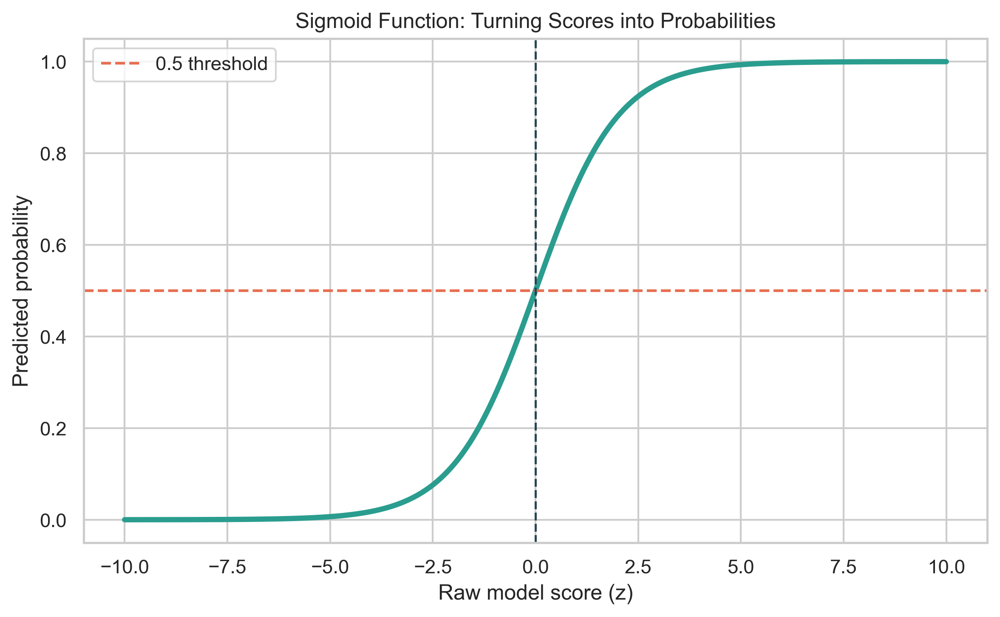
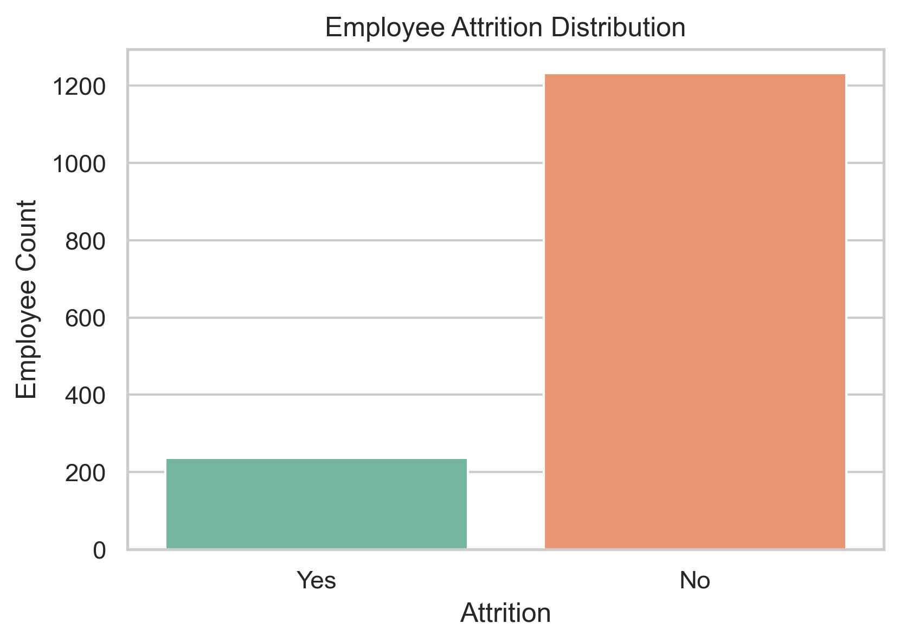
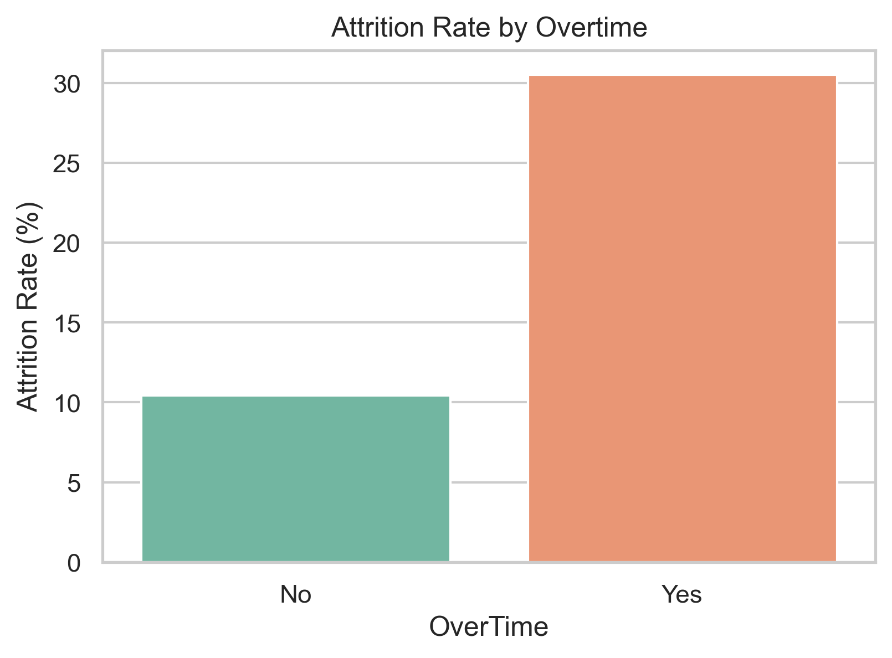
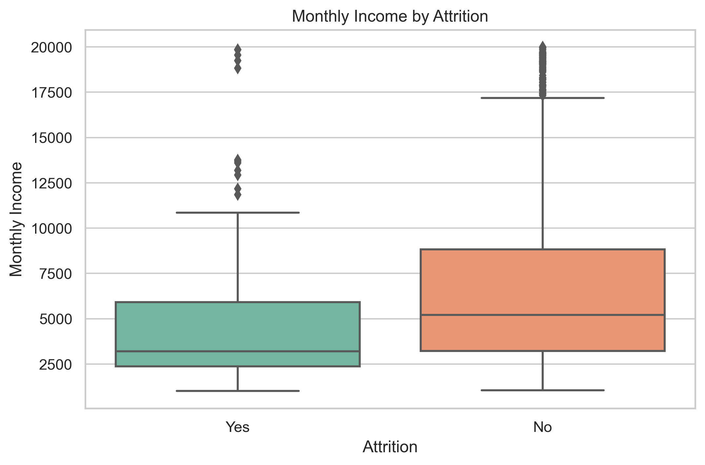
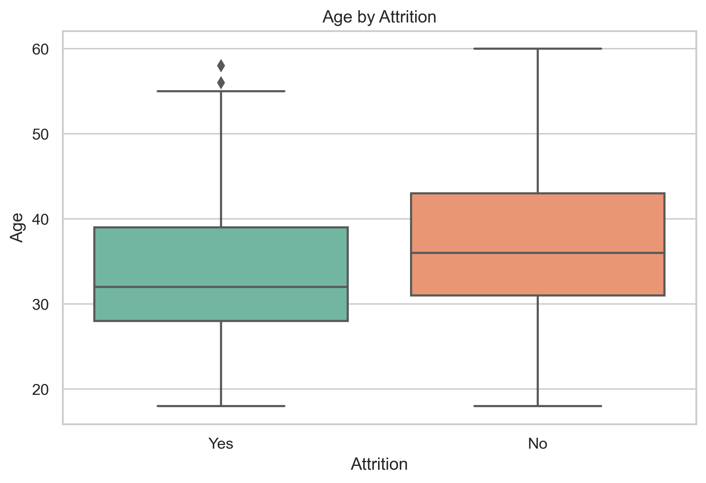
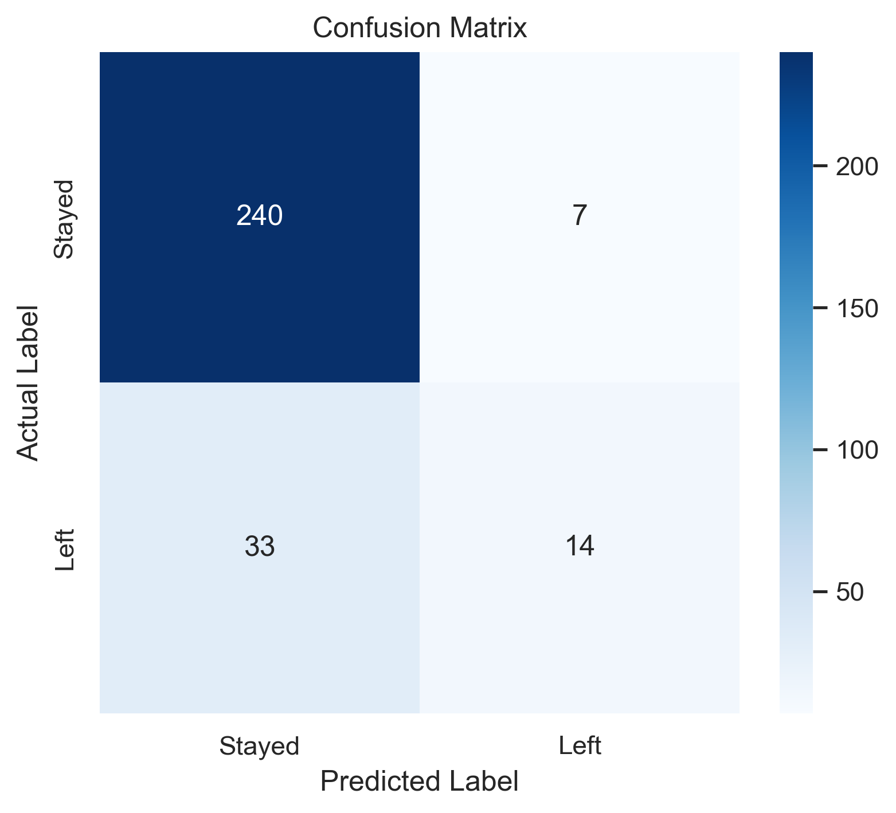
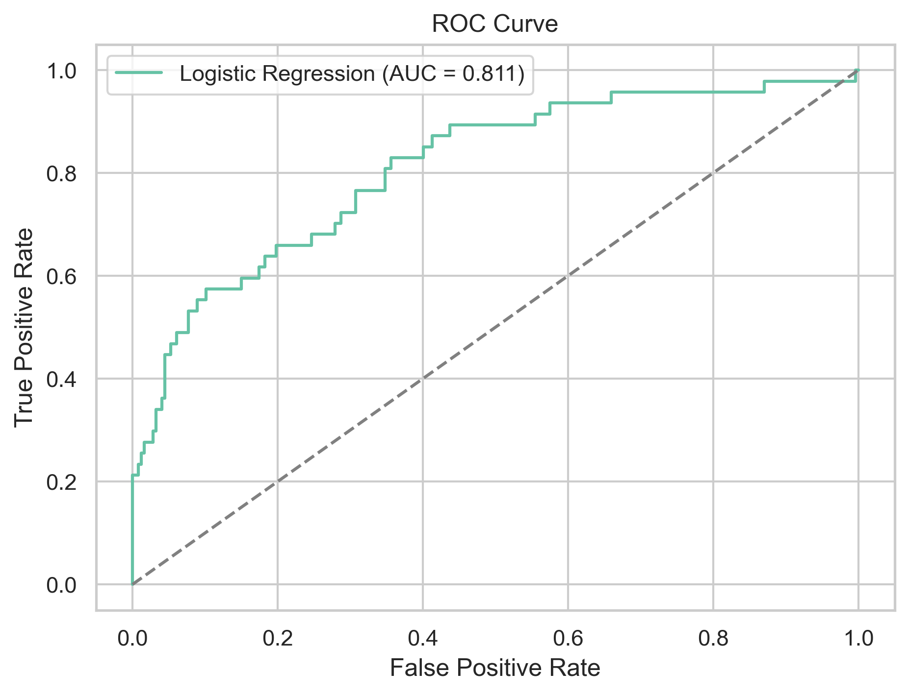
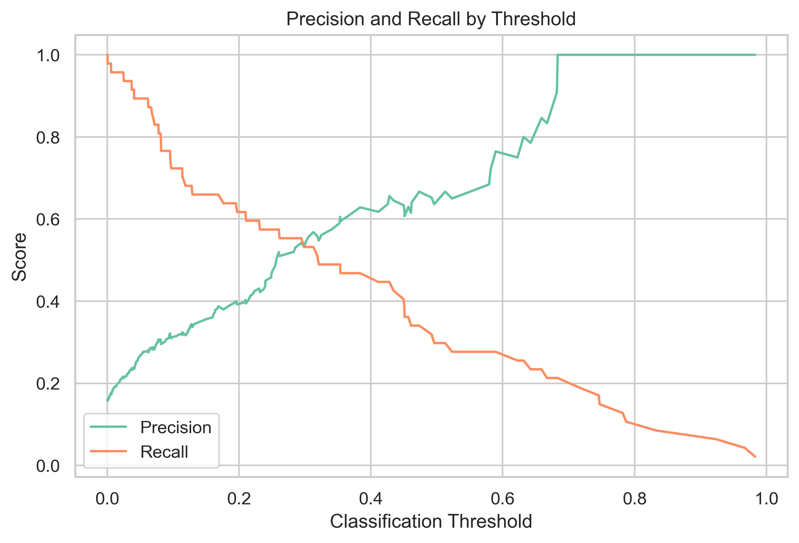
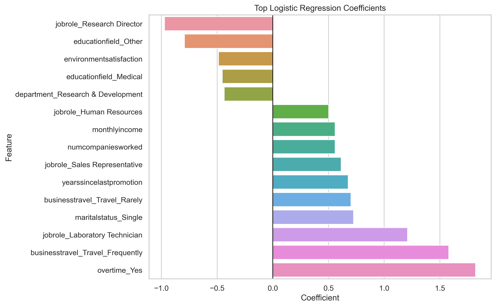

# Logistic Regression Explained Intuitively: Predicting Real-World Outcomes with Python

## A beginner-friendly walkthrough using employee attrition data

Imagine you work on an HR analytics team.

One Monday morning, your manager asks a simple question:

> Can we know which employees are likely to leave before they actually resign?

At first, this sounds like a yes-or-no problem.

Will the employee leave?

Yes or no.

But in real life, the answer is rarely that clean. A better answer sounds more like this:

> This employee has a 72% chance of leaving.

That little shift from a hard label to a probability is exactly where Logistic Regression becomes useful.

In this article, we will build intuition for Logistic Regression using a real-world employee attrition project. We will go from the business problem to model training, evaluation, threshold tuning, and coefficient interpretation.

No unnecessary complexity. No black-box magic.

Just the core idea, explained clearly.

---

# 1. Hook: A Real-World Thought Experiment

Suppose a company has 1,000 employees.

Some are happy. Some are disengaged. Some are overworked. Some have long commutes. Some have not been promoted in years. Some are quietly interviewing elsewhere.

The company does not want to spy on people or make unfair assumptions. But it does want to understand patterns.

If historical HR data shows that employees with certain patterns are more likely to leave, can we use those patterns to estimate future attrition risk?

That is the kind of problem Logistic Regression was made for.

It helps us answer:

> Given what we know about this employee, how likely are they to belong to the "left the company" group?

This is not fortune-telling. It is probability-based classification.

---

# 2. Why Logistic Regression Matters

Logistic Regression is one of the most important beginner models in machine learning because it teaches several ideas at once:

- supervised learning
- binary classification
- probability prediction
- decision thresholds
- confusion matrices
- precision and recall
- model interpretability

Many people jump straight into Random Forests, XGBoost, or neural networks.

Those models are powerful, but Logistic Regression gives you something they often do not give easily:

> A clear explanation of how each feature pushes the prediction up or down.

That makes it a strong baseline model for real business problems.

Use Logistic Regression when your target looks like:

- churn vs no churn
- default vs no default
- fraud vs not fraud
- disease vs no disease
- employee leaves vs stays
- campaign response vs no response

In this project, our target is:

> Will an employee leave the company?

---

# 3. Why Linear Regression Fails for Classification

If you already know Linear Regression, you may wonder:

> Why not just use Linear Regression and predict 0 or 1?

Good question.

Linear Regression predicts continuous values. Its output can be:

- 2.4
- 0.8
- -1.2
- 17.6

That is fine when predicting a number like revenue or house price.

But classification needs probabilities.

A probability should stay between:

$$
0 \leq p \leq 1
$$

Linear Regression does not guarantee that.

It may predict a probability of `1.3` or `-0.2`, which does not make sense.

So Logistic Regression takes a different path:

1. calculate a raw model score
2. pass that score through the sigmoid function
3. turn the result into a probability between 0 and 1

That is the key upgrade.

---

# 4. Probabilities vs Predictions

One of the most important ideas in Logistic Regression is this:

> The model first predicts a probability, not a class.

For example:

| Employee | Predicted Attrition Probability |
|---|---:|
| A | 0.12 |
| B | 0.48 |
| C | 0.81 |

These probabilities are more useful than plain labels.

Why?

Because a business team can decide what level of risk matters.

If the threshold is `0.5`, then:

- probability >= 0.5 means predict attrition
- probability < 0.5 means predict no attrition

But if HR wants to catch more at-risk employees early, it may lower the threshold to `0.3`.

That is why Logistic Regression is not just a model. It is also a decision tool.

---

# 5. The Sigmoid Function Intuition

The sigmoid function is the little mathematical bridge between raw model scores and probabilities.

It looks like this:

$$
p = \frac{1}{1 + e^{-z}}
$$

Where:

- `z` is the raw score learned from the features
- `p` is the predicted probability

Here is the intuition:

- very negative scores become probabilities close to 0
- very positive scores become probabilities close to 1
- scores near 0 become probabilities near 0.5



The curve has a soft S-shape.

That shape is perfect for classification because it squeezes every raw score into a probability range.

---

# 6. What Logistic Regression Actually Learns

Logistic Regression learns coefficients.

The raw score looks like this:

$$
z = b + w_{1}x_{1} + w_{2}x_{2} + w_{3}x_{3}
$$

Where:

- `b` is the intercept
- `w` values are coefficients
- `x` values are input features

Then the model passes `z` through sigmoid:

$$
p = \frac{1}{1 + e^{-z}}
$$

In plain English:

> The model learns how much each feature pushes the probability toward leaving or staying.

A positive coefficient pushes the prediction toward attrition.

A negative coefficient pushes the prediction toward staying.

That interpretability is one of Logistic Regression's biggest strengths.

---

# 7. Dataset Introduction

For this project, I used the IBM HR Analytics Employee Attrition dataset.

The dataset contains employee-level information such as:

- age
- department
- job role
- overtime
- monthly income
- job satisfaction
- environment satisfaction
- distance from home
- years at company
- years since last promotion
- work-life balance

The target variable is:

```text
Attrition
```

It has two values:

- `Yes`: employee left
- `No`: employee stayed

For modeling, I converted:

- `Yes` to `1`
- `No` to `0`

So the model learns:

> What patterns are associated with employee attrition?

---

# 8. EDA Discoveries

Before training a model, we need to understand the data.

The first important discovery was class imbalance.

Most employees stayed. Only about 16% left.

That matters because a lazy model could predict "stayed" most of the time and still look accurate.

This is why classification projects need more than accuracy.



Some patterns also stood out during EDA.

Overtime was one of the clearest signals. Employees who worked overtime had a visibly higher attrition rate.



Monthly income and age also showed useful differences between employees who stayed and employees who left.





These plots do not prove causation.

They simply tell us:

> There may be useful signal here.

That is enough to move into modeling.

---

# 9. Training the Model

The modeling workflow was intentionally simple.

First, I cleaned the data:

- standardized column names
- removed duplicates
- encoded the target variable
- dropped constant columns

Then I created a few intuitive features:

- `income_per_job_level`
- `years_without_promotion_ratio`
- `early_career_flag`
- `long_commute_flag`

Then I prepared the feature pipeline:

- numerical features were scaled
- categorical features were one-hot encoded

Finally, I trained a baseline Logistic Regression model.

The model was not meant to be the most complex possible model.

It was meant to be understandable.

That is the point of a concept project.

---

# 10. Understanding the Confusion Matrix

After training, we need to understand where the model is right and wrong.

That is what the confusion matrix shows.



For this project:

- True Negative: employee stayed, model predicted stayed
- True Positive: employee left, model predicted left
- False Positive: employee stayed, model predicted left
- False Negative: employee left, model predicted stayed

In business language:

> A false negative means the model missed an employee who actually left.

For attrition prediction, that can be costly. If HR misses an at-risk employee, the company may lose the chance to intervene.

---

# 11. Precision vs Recall

Precision and recall are two of the most important classification metrics.

Precision asks:

> Of the employees predicted to leave, how many actually left?

Recall asks:

> Of all employees who actually left, how many did the model catch?

In this project, the baseline model produced:

```text
Accuracy:  0.8639
Precision: 0.6667
Recall:    0.2979
F1-score:  0.4118
ROC-AUC:   0.8107
```

Accuracy looks strong.

But recall is much lower.

That means the model is conservative at the default threshold. When it predicts attrition, it is often right, but it misses many employees who actually leave.

That is a great lesson:

> Good accuracy does not always mean the model is useful for the business goal.

---

# 12. ROC-AUC Intuition

ROC-AUC measures how well the model separates the two classes across many thresholds.

Think of it as a ranking test.

If the model gives higher attrition probabilities to employees who actually leave, it has useful signal.

An AUC of:

- `0.5` means random guessing
- `0.7` to `0.8` means useful signal
- above `0.8` means strong separation

This model achieved:

```text
ROC-AUC: 0.8107
```

That tells us the model is ranking risk fairly well, even if the default threshold needs tuning.



---

# 13. Threshold Tuning

The default threshold is usually `0.5`.

But business problems rarely come with a universal threshold.

If we lower the threshold, we usually catch more positive cases.

That improves recall.

But it may also create more false positives, which lowers precision.



For attrition prediction, HR may prefer a lower threshold if the goal is early intervention.

For example:

> It may be better to review 20 possible at-risk employees than to miss 10 employees who are truly likely to leave.

The best threshold depends on the cost of each mistake.

---

# 14. Coefficient Interpretation

Logistic Regression coefficients help us explain the model.

A positive coefficient means:

> This feature pushes the prediction toward attrition.

A negative coefficient means:

> This feature pushes the prediction toward staying.

Because the model uses scaled numerical features and encoded categorical features, coefficient interpretation should be done carefully.

Still, the direction and relative strength are useful.



We can also convert coefficients into odds ratios:

$$
Odds\ Ratio = e^{coefficient}
$$

If the odds ratio is above 1, the feature increases the odds of attrition.

If the odds ratio is below 1, the feature decreases the odds of attrition.

This is where Logistic Regression becomes business-friendly.

You are not just saying:

> The model predicted 1.

You are saying:

> These factors pushed the attrition probability higher or lower.

That is much easier to explain to stakeholders.

---

# 15. Where Logistic Regression Fails

Logistic Regression is useful, but it is not magic.

It can struggle when:

- relationships are highly nonlinear
- important features are missing
- classes are extremely imbalanced
- features interact in complex ways
- outliers strongly influence the model
- multicollinearity makes coefficient interpretation unstable

It also shows association, not causation.

If overtime is associated with attrition, we cannot automatically say overtime causes attrition. There may be deeper workplace factors behind both.

That distinction matters.

Good machine learning is not just model training.

It is careful thinking.

---

# 16. Final Takeaway

Logistic Regression is one of the best models for learning classification properly.

It teaches you how to think about:

- probabilities
- thresholds
- classification errors
- precision and recall
- ROC-AUC
- coefficient interpretation
- business tradeoffs

And even though it is often called a beginner model, it is still used in real-world work because it is simple, fast, and explainable.

The biggest lesson from this project is:

> A classification model is not just about predicting labels. It is about supporting decisions.

That is why Logistic Regression matters.

---

# 17. GitHub Repo Link Placeholder

Full project code, notebook, images, and reusable Python modules:

GitHub Project:  
`[Add GitHub logistic regression project link here]`

---

# 18. Companion Interview Article Placeholder

Read the companion interview guide:

`[Add Medium interview article link here]`

