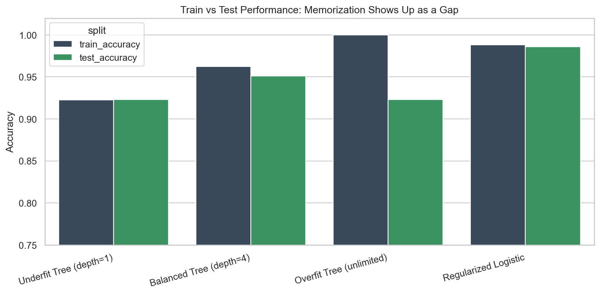
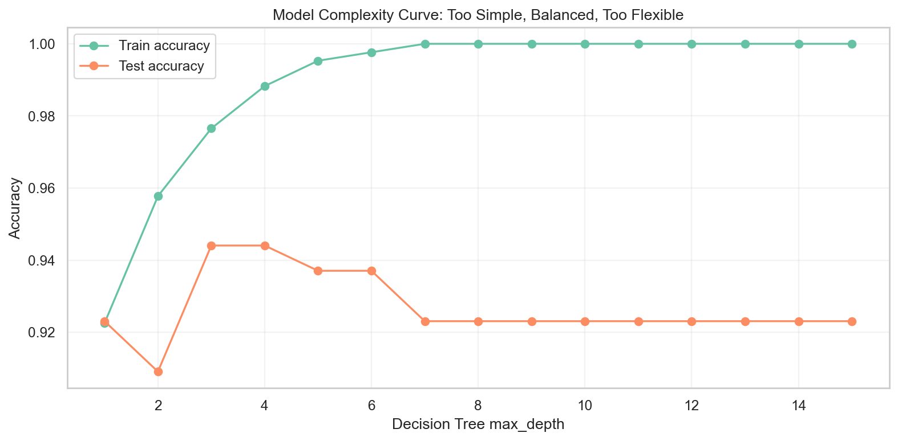
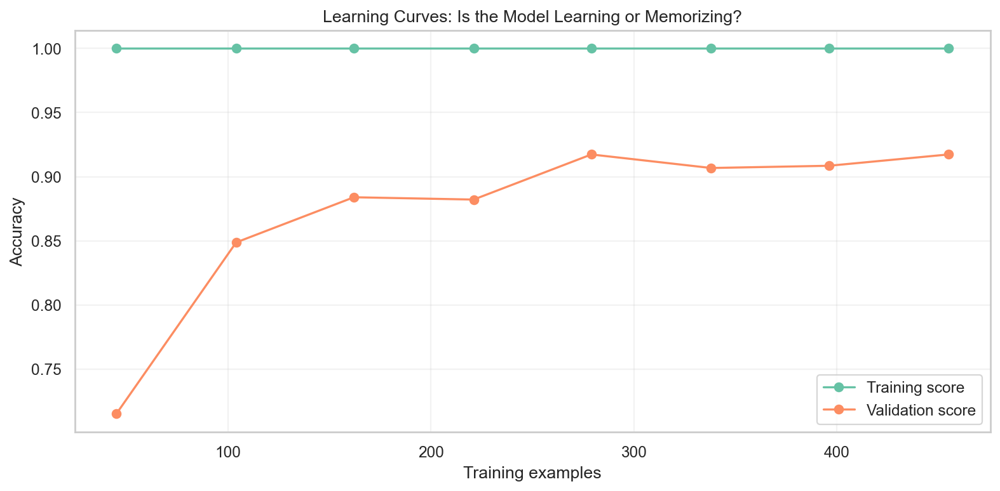

# When Machine Learning Starts Memorizing Instead of Learning - Overfitting vs Underfitting Explained Intuitively

## Why the smartest-looking model is often the one most likely to fail in the real world

There is a particular moment in machine learning that feels wonderful for about five seconds.

You train a model. You check the training accuracy. It is high. Very high. Maybe suspiciously high, but we do not call it suspicious yet because the number feels too good.

The model seems to understand everything.

Then you test it on new data.

The confidence cracks.

The model that looked brilliant in the training room suddenly becomes uncertain, brittle, and strangely wrong. It knew the old examples too well. It knew them so well that it forgot the actual job.

This is the hidden drama behind overfitting and underfitting.

These are not just vocabulary words for interviews. They are two different ways a machine learning model can fail.

One model fails because it barely learns.

Another fails because it memorizes too much.

The best model lives somewhere in between.

> A model can memorize... or it can generalize. Great ML lives in the balance.

## The Hidden Problem Behind "High Accuracy"

High accuracy can be comforting.

It can also be a trap.

When we say a model has high accuracy, we must ask a second question immediately:

> High accuracy on what?

If the answer is training data, we should be careful. Training data is not the real world. Training data is the model's study guide. It is the set of examples the model has already seen.

A student can memorize a study guide without understanding the subject. A model can memorize training examples without understanding the pattern.

That is why machine learning is not really about performing well on the past. It is about learning something from the past that still works in the future.

This project uses the Breast Cancer Wisconsin diagnostic dataset. Each row represents a medical case. The features describe measurements from cell nuclei in breast mass images. The target tells us whether the tumor is benign or malignant.

This is exactly the kind of setting where generalization matters. A healthcare model that memorizes old patients is not useful. It must help with new patients.

## Memorization vs Learning

Imagine two students preparing for an exam.

The first student memorizes every practice question. If the final exam repeats the same questions, this student looks unstoppable.

The second student studies the concepts. They may not remember every exact practice question, but they understand how the ideas work. When the final exam changes the wording, they adapt.

Machine learning models behave the same way.

The training set is the practice exam. The test set is the first check of whether the model learned anything reusable. Production is the real final exam.

Overfitting is the memorizing student.

Underfitting is the student who barely studied and learned only one vague rule.

Generalization is the student who actually understands.

## What Underfitting Looks Like

Underfitting happens when the model is too simple for the problem.

In the project notebook, we create a Decision Tree with `max_depth=1`. This is called a decision stump. It gets one split. One question. One tiny doorway into a complex medical dataset.

That model might ask something like:

> Is this measurement above or below a threshold?

Then it has to make the whole diagnosis from that one rule.

That is not enough.

Underfitting usually shows up like this:

- training performance is weak
- test performance is weak
- the gap between train and test is small
- the model is not powerful enough to capture the signal

This is high bias. The model has made the problem too simple.

High bias is not humility. It is blindness.

The model is not overreacting. It is barely reacting at all.

## What Overfitting Looks Like

Overfitting is more seductive.

The overfit model looks smart at first.

In the notebook, we also train an unrestricted Decision Tree. This tree can keep splitting and splitting. It can create narrow rules for tiny groups of training examples. It can isolate unusual cases and treat them like permanent truths.

The training accuracy climbs.

The model looks confident.

But the confidence is fragile.

Overfitting usually shows up like this:

- training performance is excellent
- test performance is weaker
- the train/test gap is large
- cross-validation may be unstable
- the model learned noise along with signal

This is high variance. The model is too sensitive to the exact training data it saw.

An overfit model does not just learn the melody. It memorizes the static in the recording.

The train/test chart is where the story becomes visible. A healthy model should not need to collapse when it leaves the training set. A large gap is the model whispering: "I knew the examples, not the pattern."

## The Sweet Spot of Generalization

The best model is rarely the most complex model.

It is also rarely the simplest.

The best model has enough flexibility to capture real structure and enough restraint to ignore noise.

In the project, the balanced Decision Tree has limits. It can learn interactions, but it cannot split forever. The regularized Logistic Regression model can use many features, but it is discouraged from assigning extreme weights.

That restraint is not a weakness.

It is what allows the model to travel.

A good model does not worship the training data. It learns from it, then lets go of the details that are unlikely to repeat.

## Bias vs Variance

Bias and variance are often explained with formulas. The formulas matter, but the intuition matters first.

Bias is the error of being too rigid.

A high-bias model walks into a complicated world and says, "I already know what shape this should be." It does not listen closely enough. It underfits.

Variance is the error of being too reactive.

A high-variance model treats every tiny fluctuation as important. It listens too closely to noise. It overfits.

Think of two students.

The high-bias student answers every question with the same oversimplified rule.

The high-variance student changes their entire worldview after every practice problem.

The strong student learns the idea underneath the examples.

That is the bias-variance tradeoff.

## Visualizing Model Complexity

The most intuitive way to understand overfitting is to watch complexity increase.

In the notebook, we train Decision Trees with increasing depth. At first, increasing depth helps. The model learns more detail. Test accuracy improves.

Then something changes.

Training accuracy may keep rising, but test accuracy stops improving. The model is still getting better at the training set, but it is no longer becoming more useful.

That is the danger zone.

The project also includes a synthetic polynomial fitting visual. A low-degree polynomial is too simple. A moderate polynomial follows the real shape. A very high-degree polynomial wiggles through the training points like it is trying to impress the past.

That wiggly curve is overfitting in one picture.

## Cross Validation

One train/test split is only one version of reality.

Maybe the split was lucky. Maybe the test set was easier than usual. Maybe the hard examples all landed in one fold.

Cross-validation helps by rotating the validation role across multiple slices of the dataset.

Instead of asking:

> Did the model work on this one split?

We ask:

> Does the model keep working across different splits?

This is closer to how real engineering teams think. They do not want a model that survives one convenient test. They want evidence that the model is stable.

## Regularization

Regularization is how we teach models restraint.

For Logistic Regression, regularization discourages extreme coefficients. The model can still learn, but it is asked not to become too dramatic about any one feature.

For Decision Trees, restraint can look like:

- limiting `max_depth`
- increasing `min_samples_leaf`
- pruning branches
- requiring stronger evidence before splitting

Regularization is not about making a model weaker.

It is about making the model less gullible.

When a model overfits, it believes too many details. Regularization asks it to focus on the patterns that are more likely to survive new data.

## Learning Curves

Learning curves show how training and validation performance change as the model gets more data.

They are one of the most practical debugging tools in machine learning.

If both training and validation scores are low, the model may be underfitting.

If training score is high and validation score is much lower, the model may be overfitting.

If validation performance keeps improving as data increases, more data may help.

Learning curves turn model failure into a conversation.

They help us ask better questions:

- Does the model need more complexity?
- Does it need stronger regularization?
- Does it need more data?
- Are the features weak?
- Is the validation design trustworthy?

## Practical Debugging

Real ML debugging is not just trying algorithms until one looks better.

It is diagnosis.

If training and test performance are both poor, I suspect underfitting. Maybe the model is too simple. Maybe the features are weak. Maybe regularization is too strong.

If training performance is excellent and test performance is weak, I suspect overfitting. Maybe the model is too complex. Maybe there is too little data. Maybe the model is memorizing small pockets of the training set.

If validation performance is unbelievably high, I suspect leakage. Maybe future information slipped into the features. Maybe preprocessing happened before the split. Maybe the target is encoded indirectly somewhere.

If cross-validation scores jump around, I suspect instability. The model may be too sensitive to which rows it sees.

This is how ML engineers think. They read model behavior like symptoms.

## Final Takeaway

Overfitting and underfitting are not just definitions.

They are two different stories of failure.

Underfitting is the model that cannot hear the signal.

Overfitting is the model that hears signal in everything.

Generalization is the balance. It is the model learning what matters, ignoring what does not, and carrying that understanding into new data.

Machine learning does not reward the model that remembers the most.

It rewards the model that learns what still matters when the scene changes.

GitHub repo placeholder: `[Add GitHub link here]`

Companion interview article placeholder: `[Add Medium interview article link here]`

