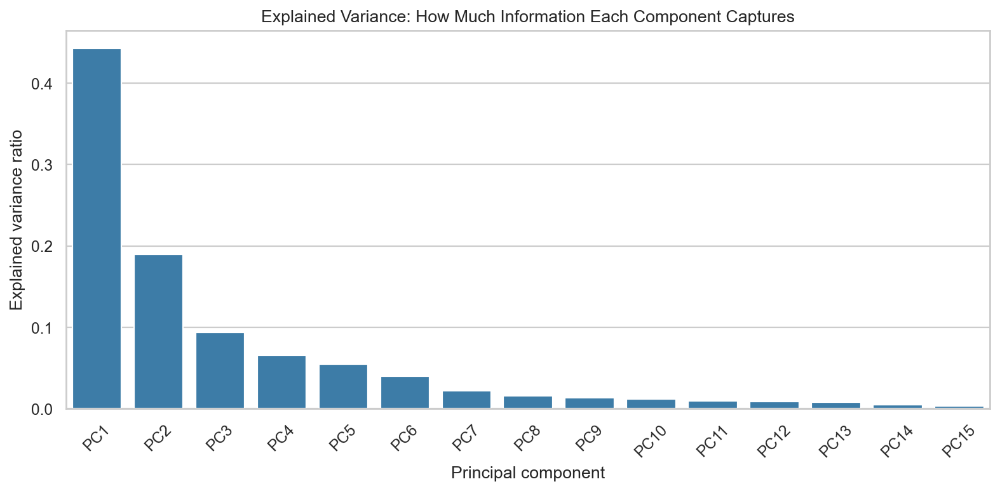
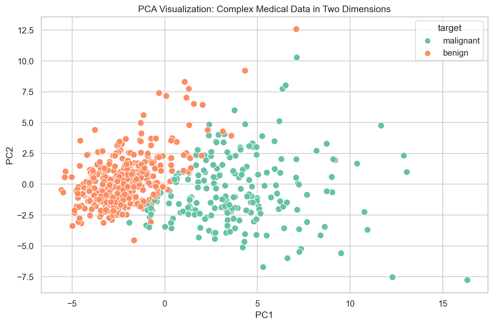
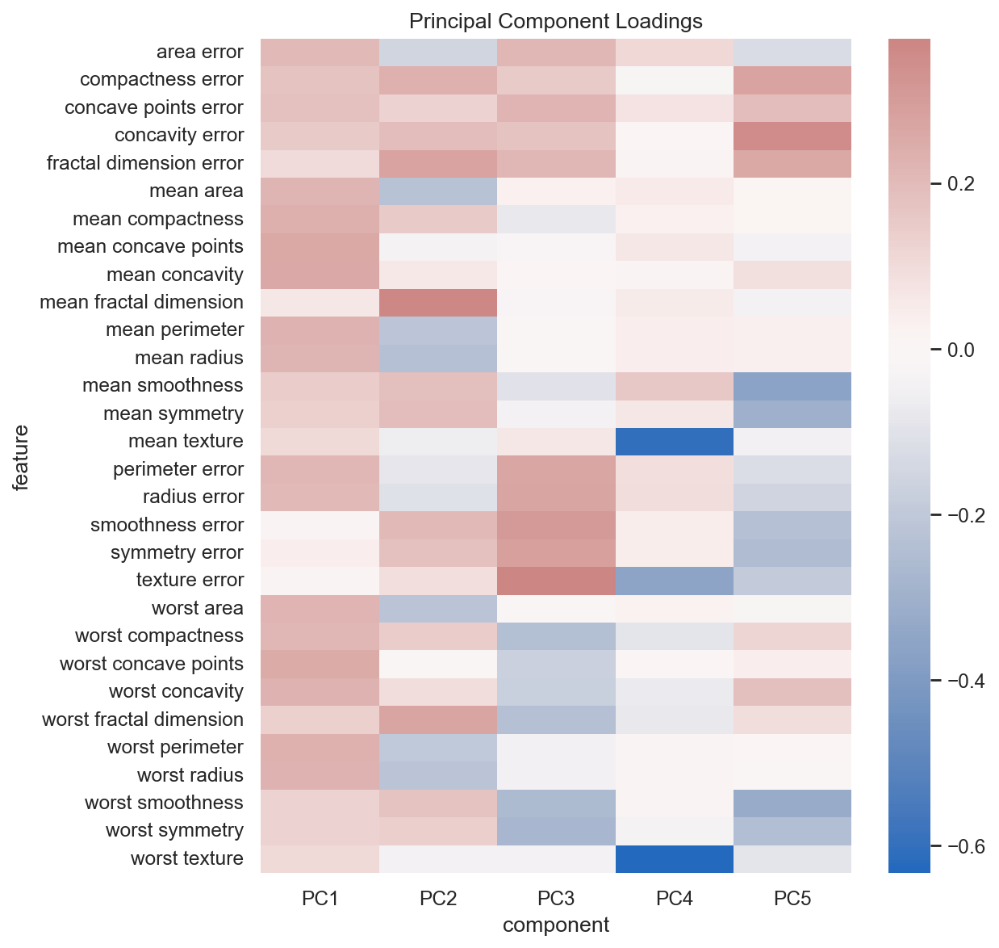

# How Machines Compress Complex Data Into Hidden Patterns - PCA Explained Intuitively

## What if your data secretly contains simpler hidden structure... and PCA can uncover it by compressing the noise away?

High-dimensional data can feel like a room with too many lights on.

Every feature shines. Every measurement asks for attention. Some features are useful. Some repeat what other features already say. Some add noise. Some make the pattern harder to see.

PCA is one of the most elegant ideas in machine learning because it asks:

> What if this complexity has a simpler shape underneath?

It does not randomly delete columns.

It finds the directions where the data's strongest patterns live.

It rotates the view.

It compresses the story.

## The Hidden Problem With Too Many Features

More features can feel like more information.

But sometimes more features mean more repetition.

In medical data, radius, perimeter, and area are separate measurements, but they often move together. In customer analytics, page views, session length, and engagement score may tell overlapping stories. In image data, neighboring pixels are often highly related.

This redundancy makes data look bigger than it really is.

PCA helps compress overlapping information into fewer signals.

## Why High-Dimensional Data Is Difficult

High-dimensional data is hard to visualize.

Humans can reason about two or three dimensions. A dataset with 30, 300, or 3,000 features is not something we can simply look at.

High dimensions can also make models slower, noisier, and more prone to overfitting.

That is why dimensionality reduction matters.

It turns overwhelming detail into a cleaner representation.

## What PCA Actually Does

PCA finds new axes through the data.

Imagine holding a complex object. From one angle, it looks confusing. Rotate it, and suddenly the shape becomes clear.

PCA does something similar.

It rotates the feature space so the first new axis captures the strongest direction of variation. The second captures the next strongest direction, and so on.

These new axes are principal components.

## Variance and Information

PCA treats variance as information.

If data spreads strongly in one direction, that direction probably tells us something about how examples differ.

The first principal component captures the largest spread.

The second captures the next largest spread.

By keeping the top components, PCA keeps the strongest patterns and discards weaker directions.

This is compression with intention.

## Principal Components

Principal components are not original columns.

They are combinations of original features.

That is why PCA can be powerful and hard to interpret at the same time. A component may blend radius, perimeter, texture, smoothness, and other measurements into one compressed signal.

The component may be useful, but it is less immediately human-readable.

## Why Scaling Matters

PCA is sensitive to scale.

If one feature has much larger values than another, PCA may treat it as more important simply because it has more numerical spread.

Scaling puts features on equal footing.

Without scaling, PCA may compress measurement units instead of meaningful structure.

## Explained Variance

Explained variance tells us how much information each component captures.

Cumulative explained variance tells us how much information we keep as we add components.

This creates the central PCA tradeoff:

> How much simplicity can we gain before we lose too much information?

## Visualizing Data After PCA

One of PCA's most satisfying uses is visualization.

In the project, we compress 30 medical features into two principal components.

The original data is impossible to see directly. The PCA view gives us a map.

PCA did not use the diagnosis label to create this map. It only used the feature structure.

Yet the compressed view reveals meaningful separation.

That is the quiet magic of PCA.

## Noise Reduction

PCA can reduce noise by dropping weaker components.

If a direction explains very little variance, it may represent small detail, measurement noise, or less useful variation.

By keeping only stronger components, PCA can create a cleaner representation.

This is why PCA is used in image compression, signal processing, and preprocessing for machine learning.

## PCA in Real ML Systems

PCA can help real systems by:

- reducing storage
- speeding up models
- reducing redundant features
- improving visualization
- reducing noise
- making high-dimensional pipelines easier to manage

But PCA should be tested. Compression is useful only if the model still performs well enough for the task.

## Understanding Component Loadings

Loadings show how original features contribute to components.

They help us peek inside PCA.

But PCA components are still harder to explain than original features because each component mixes many measurements.

## PCA vs t-SNE vs UMAP

PCA is linear and preserves broad global structure.

t-SNE is nonlinear and focuses on local neighborhoods, mostly for visualization.

UMAP is nonlinear and often preserves useful local and global structure.

PCA is usually the fastest and most interpretable first step.

## Final Takeaway

PCA is not just dimensionality reduction.

It is a way to discover that complex data may have a simpler hidden shape.

It rotates reality, keeps the strongest directions, and lets us see patterns that were buried inside too many features.

GitHub repo placeholder: `[Add GitHub link here]`

Companion interview article placeholder: `[Add Medium interview article link here]`

