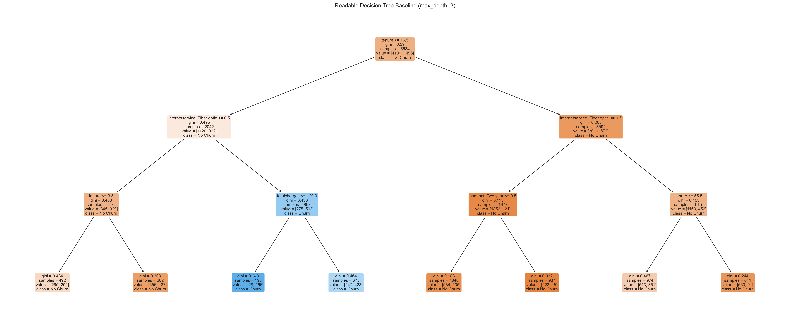
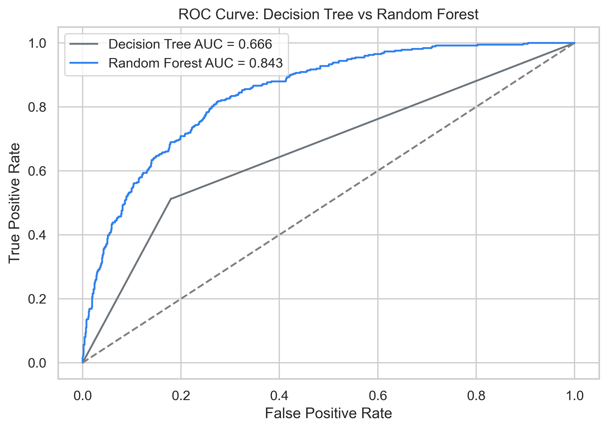
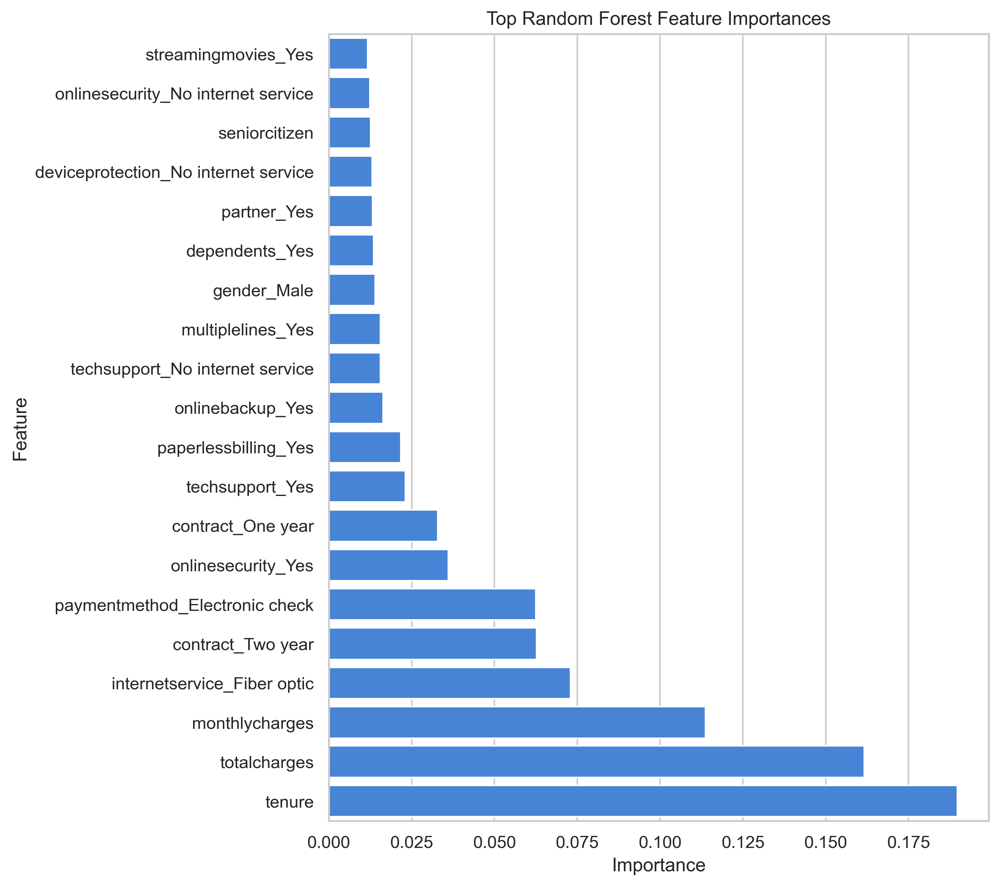

# The Forest That Outsmarts a Single Tree — Random Forests Explained Intuitively

Subtitle: Why asking many imperfect trees often beats trusting one “smart” model

A single Decision Tree feels wonderfully confident.

It asks a question, follows a branch, asks another question, and finally reaches a prediction. There is something satisfying about that. It feels tidy. It feels explainable. It feels like the model has a plan.

But confidence is not the same thing as wisdom.

A Decision Tree can become too attached to the training data. It can learn tiny accidents as if they were deep truths. It can create rules that sound precise but are really just memorized details.

That is where Random Forest enters the story.

Random Forest asks a beautifully practical question:

> What if we stopped trusting one tree so much?

Instead of building one Decision Tree and hoping it learned the right pattern, Random Forest builds many trees. Each tree gets a slightly different view of the data. Each tree forms its own opinion. Then the forest votes.

One Decision Tree is smart.

A forest of them is powerful.



## The Problem With One Smart Tree

Imagine asking one expert whether a customer is likely to churn.

That expert might be brilliant. But they might also overreact to one strange detail.

Maybe they once saw a customer with high monthly charges leave, so they start treating high monthly charges as the whole story. Maybe they notice a tiny pattern in one region of the data and turn it into a rule that does not generalize.

A single Decision Tree behaves like that sometimes.

It is flexible enough to capture useful patterns, but that same flexibility makes it fragile. If you let it grow too deep, it can keep splitting until it memorizes the training data.

It can become very good at explaining the past and less good at predicting the future.

That is overfitting.

## The Wisdom of Crowds

Random Forest uses the wisdom-of-crowds idea.

If you ask one person to estimate something, they may be wrong in a very personal way. If you ask many people, their individual errors can cancel out.

Think about asking several doctors for opinions, polling many engineers before a launch decision, or letting a panel of reviewers judge a proposal. Each person brings some noise. But the group can be more stable than any one person.

Random Forest does something similar with Decision Trees.

It trains many trees, then combines their predictions.

For classification, the trees vote.

If most trees predict churn, the forest predicts churn.

If most trees predict no churn, the forest predicts no churn.

The magic is not that every tree is perfect.

The magic is that the trees are imperfect in different ways.

## A Small Human Example

Suppose three people are trying to guess whether a customer will leave.

The first person focuses heavily on price.

The second person focuses heavily on contract type.

The third person focuses heavily on customer support.

Alone, each person has a bias. Each person sees part of the picture.

But together, their opinions may balance each other.

Random Forest works in that spirit. It does not expect every tree to be wise. It expects the group to be wiser than the average individual tree.

This is a practical idea in machine learning. Sometimes the best way to make a model stronger is not to make one model more complicated. Sometimes it is to combine many simple models in a thoughtful way.

## How the Forest Creates Different Opinions

Random Forest uses two major sources of randomness.

The first is bootstrap sampling.

Each tree is trained on a random sample of the training data, selected with replacement. That means some rows appear more than once, and some rows are left out.

So Tree 1 sees one version of the dataset.

Tree 2 sees another version.

Tree 3 sees another.

The second source is feature randomness.

At each split, the tree does not get to consider every feature. It only sees a random subset of features.

This matters because without feature randomness, many trees might all pick the same strongest feature and become too similar.

Random Forest wants useful disagreement.

Not chaos.

Not randomness for its own sake.

Useful disagreement.

## Why the Trees Should Not All Agree Too Quickly

If every tree in the forest sees the same rows and the same features, the forest becomes a room full of people repeating the same opinion.

That is not very useful.

The point of a Random Forest is not simply quantity. It is diversity.

Bootstrap sampling changes the rows each tree learns from.

Feature randomness changes the questions each tree is allowed to ask.

Together, these make the trees less correlated.

That word, correlated, is important. If all trees make the same mistake, voting will not save us. But if different trees make different mistakes, the average prediction becomes more reliable.

This is why Random Forest is not just "many trees." It is many trees trained with deliberate randomness.

## The Dataset Story: Customer Churn

In this project, we use the IBM Telco Customer Churn dataset.

The business question is simple:

> Can we predict whether a telecom customer is likely to leave?

Churn matters because losing customers is expensive. A company has already paid to acquire those customers. If they leave, future revenue disappears, and the company may need to spend even more money replacing them.

A churn model can help the business act earlier.

Instead of waiting until customers leave, the company can identify risk patterns and design better retention strategies.

The dataset includes features such as:

- tenure
- contract type
- monthly charges
- total charges
- internet service
- online security
- tech support
- payment method

These are not abstract columns. They tell a customer relationship story.

A month-to-month customer with high monthly charges and limited support services may behave differently from a long-tenure customer on a two-year contract.

Random Forest is useful because it can capture those interactions without us manually writing every possible rule.

## What Churn Looks Like in Real Life

Churn is not usually one dramatic moment.

It is often a slow cooling-off.

A customer starts with excitement. Then maybe the bill feels high. Maybe support is not helpful. Maybe the contract is month-to-month, so leaving is easy. Maybe a competitor offers a better deal.

By the time the customer cancels, the pattern may have been visible for weeks or months.

This is where machine learning becomes useful. Not because it knows the customer's heart, but because it can notice patterns across thousands of customers that a human team might not see one by one.

A churn model is not a crystal ball.

It is an early-warning system.

## First, We Let One Tree Try

Before building the forest, we train one Decision Tree.

This is important because it gives us a baseline and a teaching moment.

A single tree often performs extremely well on training data. It may look impressive at first. But when we compare training accuracy with test accuracy, the problem appears.

The tree has learned the training data too closely.

It is not completely wrong. It has learned real patterns. But it has also learned noise.

This is why Random Forest feels like the natural next chapter after Decision Trees.

We do not throw away trees.

We stop trusting just one.

## Building the Forest

In scikit-learn, the model looks like this:

```python
RandomForestClassifier(
    n_estimators=300,
    max_depth=10,
    random_state=42
)
```

`n_estimators` tells the model how many trees to build.

`max_depth` limits how deep each tree can grow.

`random_state` makes the results reproducible.

But the important idea is not the code.

The important idea is the voting system.

Each tree sees a slightly different training world. Each tree learns a slightly different set of rules. When a new customer arrives, every tree gets a vote.

The forest prediction is the group decision.

## Why Averaging Reduces Mistakes

Here is the heart of Random Forest:

> Averaging reduces variance.

Variance means sensitivity.

A high-variance model changes a lot when the training data changes. Decision Trees are high-variance models. They can swing dramatically depending on the exact rows they see.

Random Forest lowers that sensitivity.

If one tree overreacts, another tree may not.

If one tree follows a noisy branch, another tree may vote differently.

The final prediction becomes smoother and more stable.

This is why Random Forest often performs better than one Decision Tree on real tabular datasets.

It is not because each tree is smarter.

It is because the forest is less lonely.

## The Bias-Variance Tradeoff, Without the Headache

You will often hear Random Forest explained through variance reduction.

That phrase can sound abstract, so let us make it concrete.

A model with high variance is jumpy. Give it a slightly different training dataset and it may learn a very different pattern.

A deep Decision Tree is jumpy.

It can split again and again until it fits tiny details.

Random Forest calms that jumpiness by averaging many jumpy models.

The individual trees may still be flexible, but the final forest prediction is smoother because it is a group decision.

That is the core tradeoff:

- a single tree is highly interpretable but unstable
- a forest is harder to draw but more dependable

This is real-world ML thinking. We are not just asking, "Can the model fit?" We are asking, "Can we trust it on customers it has never seen?"

## Evaluating the Model

For churn prediction, accuracy is not enough.

We also look at:

- precision
- recall
- F1-score
- confusion matrix
- ROC-AUC

Precision asks:

> Of the customers we predicted would churn, how many actually churned?

Recall asks:

> Of all customers who actually churned, how many did we catch?

ROC-AUC asks:

> How well does the model rank churn risk across different thresholds?

In business, these metrics connect directly to action.

If retention offers are expensive, precision matters.

If missing churners is expensive, recall matters.

If the team wants a ranked customer list, ROC-AUC matters.



## Reading the Confusion Matrix Like a Business Person

The confusion matrix is not just a technical table.

It is a small map of business consequences.

A true positive means:

> The customer was likely to churn, and the model caught it.

A false positive means:

> The model flagged a customer who would have stayed anyway.

A false negative means:

> A customer churned, but the model missed the warning sign.

For a telecom company, false negatives can be painful because the customer leaves without intervention. False positives can also matter if retention offers are expensive.

This is why model evaluation should always come back to the decision being made.

A model is not good in the abstract.

A model is good when it helps the business make a better decision.

## Feature Importance

Random Forest also gives us feature importance.



Feature importance helps us ask:

> Which variables did the forest rely on most?

In churn problems, common important features include contract type, tenure, monthly charges, total charges, and support-related services.

This makes business sense.

Contract type tells us about commitment.

Tenure tells us about relationship maturity.

Monthly charges tell us about cost pressure.

Support services tell us about customer experience.

But we should be careful.

Feature importance is not causation. It does not prove that changing one feature will automatically change churn. It tells us which features were useful for prediction inside this model.

That distinction is small but important.

## What Feature Importance Can and Cannot Tell You

Feature importance is a flashlight, not a verdict.

It can point the team toward useful questions:

- Are month-to-month contracts driving churn risk?
- Are newer customers leaving faster?
- Do customers without tech support churn more often?
- Are high charges creating retention pressure?

But feature importance cannot tell us what would happen if we changed a policy.

For that, we need experiments, causal analysis, or careful business testing.

This is where mature ML work begins. The model gives us clues. The business still needs to investigate.

## Hyperparameter Tuning Without the Fog

Random Forest has several knobs.

The main ones are:

- `n_estimators`
- `max_depth`
- `min_samples_split`
- `min_samples_leaf`
- `max_features`

`n_estimators` is the number of trees. More trees usually make the model more stable, but they take longer.

`max_depth` controls how complex each tree can become.

`min_samples_split` prevents tiny splits.

`min_samples_leaf` prevents tiny final groups.

`max_features` controls how many features each split can consider.

Tuning is not about hunting for magical numbers. It is about managing the tradeoff between flexibility and generalization.

## Why Random Forest Became an Industry Favorite

Random Forest became popular because it works well on many messy, real-world tabular datasets.

It does not require much feature scaling.

It handles nonlinear relationships.

It captures interactions.

It is more stable than a single Decision Tree.

It gives feature importance.

And it is usually strong enough to be a serious baseline.

That combination is rare.

Random Forest is not always the final winner, especially when models like XGBoost or LightGBM are tuned carefully. But it is one of the most reliable models to try early in a tabular ML project.

## The Tradeoff: Interpretability vs Power

A single Decision Tree is easy to draw.

A Random Forest is harder to explain because it contains hundreds of trees.

That is the tradeoff.

We gain stability and performance, but we lose some transparency.

This does not mean Random Forest is a black box in the same way as a deep neural network. We still have feature importance, partial dependence, permutation importance, and SHAP.

But we cannot easily explain the whole forest as one simple flowchart.

So the business question becomes:

> Do we need the simplest explanation, or do we need a more reliable prediction?

The answer depends on the project.

## A Practical Way to Use This Model

In a real company, I would not simply say:

> This customer will churn.

I would use the model to create a ranked list of risk.

The retention team could review the top-risk customers, apply business rules, and decide who should receive outreach.

For example:

- high churn probability and high customer value: prioritize human outreach
- medium churn probability and low support usage: send education or onboarding material
- high churn probability but low profitability: consider lower-cost automated retention

This is how machine learning becomes useful. It turns raw data into prioritization.

The model does not replace strategy.

It sharpens it.

## Final Takeaway

Random Forest is powerful because it respects a humble truth:

> One model can be clever and still be wrong in a very specific way.

Instead of trusting one tree, Random Forest builds many.

Instead of asking one opinion, it asks a crowd.

Instead of letting one path dominate, it averages many paths.

That is why it reduces overfitting.

That is why it improves stability.

That is why it became one of the most useful models in practical machine learning.

One Decision Tree is smart.

A forest of them is powerful.

GitHub repo link: `[add GitHub link here]`

Companion interview article: `[add Medium interview article link here]`
