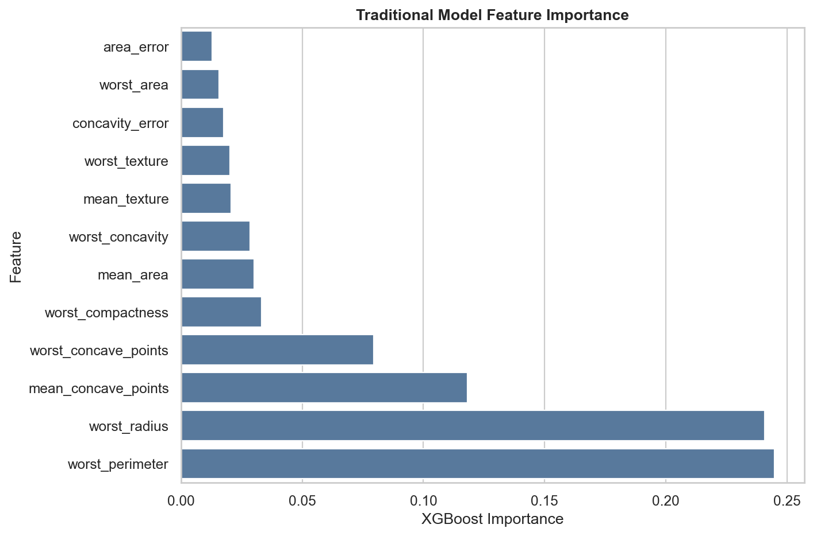
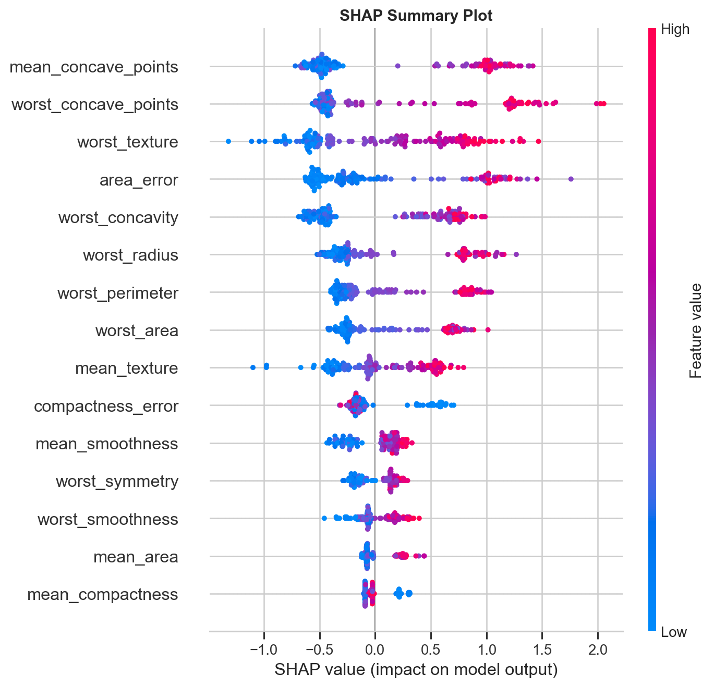
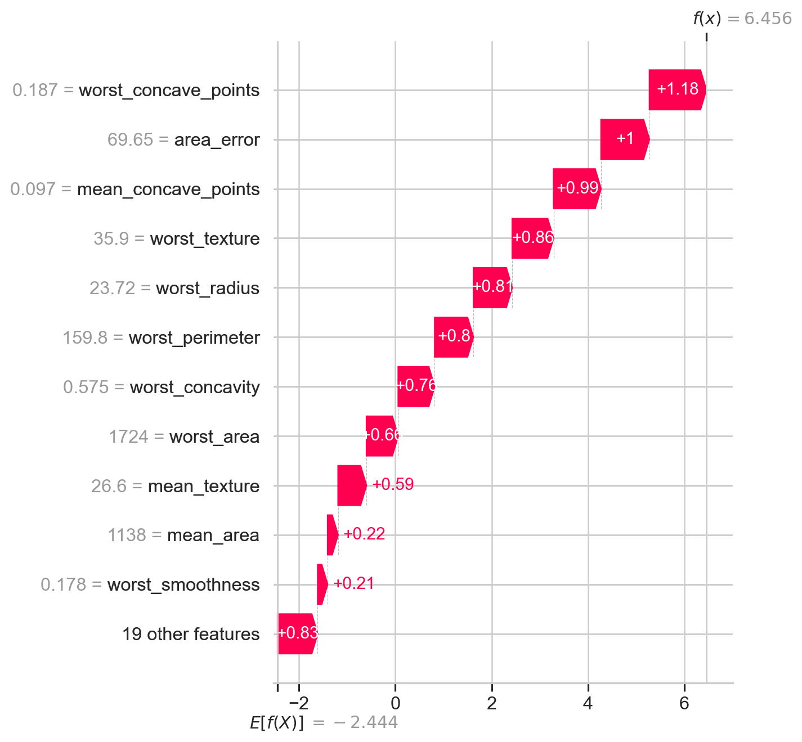
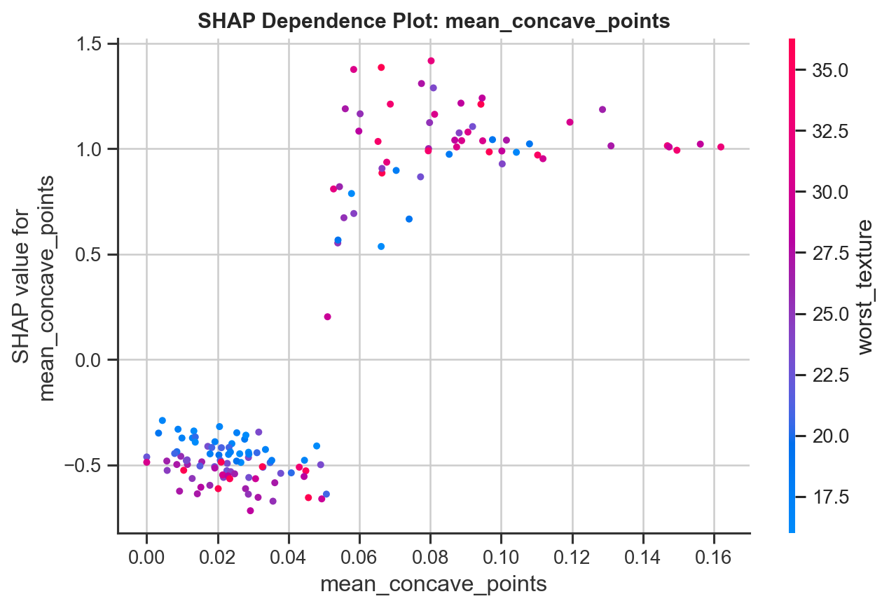

# How SHAP Lets You Peek Inside the Black Box of Machine Learning - Explainable AI Explained Intuitively

## Subtitle

What if your machine learning model could finally explain WHY it made a prediction instead of behaving like a mysterious black box?

## The Moment the Score Is Not Enough

Imagine a model says a patient is high-risk.

The probability is confident. The dashboard is clean. The metric report looks impressive.

Then someone asks the question that changes everything:

> Why?

That single word is where explainable AI begins.

In simple machine learning demos, predictions often feel harmless. A model predicts a flower species, a house price, or whether a customer might churn. But in the real world, predictions can affect access to care, loan approvals, insurance pricing, fraud investigations, hiring decisions, and personal opportunity.

When a model touches people's lives, accuracy alone is not enough.

We need to understand what the model is doing.

We need to know whether it learned meaningful patterns or dangerous shortcuts.

We need a way to open the black box.

That is where SHAP becomes powerful.

## The Hidden Problem With Black-Box AI

A black-box model is not necessarily bad.

Some black-box models are incredibly useful. Gradient boosting, random forests, neural networks, and large AI systems can detect patterns that simpler models miss.

The problem is not power.

The problem is silence.

A model can produce a prediction without explaining itself. It can say yes or no, high risk or low risk, approve or reject, malignant or benign. But if it cannot explain the reasoning, humans are left with a decision that may be technically impressive and practically impossible to defend.

Imagine a doctor who refuses to explain a diagnosis.

Imagine a bank that rejects a loan and says, “The system decided.”

Imagine a hiring model that quietly filters candidates but cannot show which signals drove the decision.

This is not just uncomfortable. It is dangerous.

Black-box models can learn bias. They can rely on proxy variables. They can behave differently across subgroups. They can be accurate on average while failing in exactly the cases where accountability matters most.

Explainability is how we begin asking better questions.

## What Explainable AI Is Really About

Explainable AI, or XAI, is the practice of making model behavior understandable.

It is not about making every model simple.

It is about making model decisions inspectable.

There are two kinds of explanations that matter a lot.

Global explanations tell us what the model tends to care about overall.

Local explanations tell us why one specific prediction happened.

Both are necessary.

A hospital may want to know which medical measurements generally influence the diagnostic model. That is global explainability.

A doctor may also want to know why this patient received this risk score today. That is local explainability.

SHAP gives us both.

## What SHAP Actually Does

SHAP explains predictions as feature contributions.

Start with a baseline prediction. This is the model's average starting point before looking at the specific case.

Then every feature pushes the prediction up or down.

For a medical model, one measurement may push the prediction toward malignant. Another may push it toward benign. Another may barely matter.

The final prediction is the combination of those pushes.

That is the core intuition:

> SHAP turns a prediction into a ledger of feature contributions.

Think of a team project. The project succeeds, but each teammate contributed differently. SHAP asks how much credit each teammate deserves.

Think of a recipe. The final flavor comes from salt, acid, heat, fat, and sweetness. SHAP asks how much each ingredient changed the result.

Think of a business decision. Revenue changed, but pricing, traffic, conversion, and retention all played a role. SHAP asks how much each factor contributed.

SHAP brings that accounting mindset to machine learning predictions.

## Feature Contributions: The Push and Pull of a Prediction

A SHAP value can be positive or negative.

A positive SHAP value pushes the prediction upward for the class being explained.

A negative SHAP value pushes it downward.

In this project, the model predicts whether a breast cancer sample is malignant.

So a positive SHAP value pushes the model toward malignant.

A negative SHAP value pushes the model away from malignant.

That directional language matters. Traditional feature importance might say a feature matters, but SHAP shows how it matters for each case.

The model is no longer just saying, “This feature is important.”

It is saying, “For this sample, this feature pushed risk up, this one pushed risk down, and this one barely changed the decision.”

That is a much more human explanation.

## Global Explainability

Global SHAP plots show the model's overall behavior.

A SHAP summary plot reveals which features are most influential across many predictions and how their values push the model.

This is useful for sanity-checking the model.

In a medical setting, we want the model to rely on clinically meaningful measurements. If the most influential features make no domain sense, that is a warning sign.

Global explanations help us ask:

- What does the model care about most?
- Are the strongest features plausible?
- Are high values pushing predictions in sensible directions?
- Is the model relying on surprising patterns?

This is model auditing, not just model decoration.

## Local Explainability

Local explanations are where SHAP feels almost magical.

Instead of asking what the model usually does, we ask why it made one specific prediction.

Imagine a doctor reviewing a model-assisted diagnosis. The doctor does not only need the global feature ranking. They need to know why this patient's prediction is high-risk.

A SHAP waterfall plot shows the story of that prediction step by step.

The plot starts from the baseline. Then features push the prediction up or down. The final output becomes explainable as a path, not a mystery.

That changes the relationship between human and model.

The human can challenge the model.

The human can ask whether the reasoning makes sense.

The human can notice if the model is leaning too heavily on a questionable signal.

Local explainability turns a prediction into a conversation.

## Dependence Plots and Hidden Model Behavior

A dependence plot shows how one feature's value changes its SHAP contribution.

This is where model behavior becomes visible in a different way.

A feature might not have a straight-line relationship with risk. It may matter only after a threshold. It may interact with another feature. It may have a stronger effect for certain ranges.

Black-box models are powerful partly because they can learn these nonlinear patterns.

SHAP helps us see them.

## Explaining Wrong Predictions

Explainability is not only for impressive demos.

It is a debugging tool.

When a model is wrong, SHAP can help us inspect why.

Was the case genuinely ambiguous?

Did the model overreact to one feature?

Did it ignore a signal that should have mattered?

Did correlated features split credit in a confusing way?

Did the model learn a shortcut?

This is where SHAP becomes practical for machine learning engineers. It helps move model debugging beyond aggregate metrics and into the mechanics of individual failures.

## Bias and Responsible AI

SHAP can also support bias investigation.

It can show whether sensitive attributes or proxy variables are influencing predictions. It can reveal whether different groups receive different explanation patterns. It can help auditors see whether a model's reasoning aligns with policy, ethics, and domain expectations.

But SHAP is not a fairness guarantee.

This is important.

SHAP explains the model. It does not automatically prove the model is fair, causal, ethical, or safe.

If the dataset lacks demographic context, we cannot fully audit demographic fairness. If features are correlated, contribution values can be difficult to interpret. If a model learned from biased history, SHAP may reveal the bias, but it will not remove it by itself.

Explainability is a flashlight, not a cure.

## Explainability vs Accuracy

Sometimes the most accurate model is not the most appropriate model.

In low-stakes settings, a tiny accuracy improvement may be worth a little opacity.

In healthcare, finance, hiring, safety, and legal decisions, the tradeoff changes.

A business may prefer a model that is slightly less accurate but much easier to explain, monitor, and defend.

The real question is not always:

> Which model has the highest score?

Often it is:

> Which model is accurate enough, explainable enough, and responsible enough for this decision?

That is a more mature machine learning question.

## Why Businesses Care

Businesses care about explainability because trust has operational value.

Customer support teams need to explain decisions.

Risk teams need to audit model behavior.

Regulators may require documentation.

Executives need confidence that the model is not creating hidden liability.

Data scientists need tools to debug failures.

Domain experts need to validate whether the reasoning makes sense.

Explainability is not only technical. It is organizational.

## Real-World Applications

SHAP and explainable AI matter in many domains:

- healthcare diagnosis support
- credit scoring
- fraud detection
- insurance underwriting
- hiring systems
- churn prediction
- recommendation systems
- pricing models
- GenAI safety and evaluation

The common thread is accountability.

If a model influences a real decision, someone will eventually ask why.

## Limitations of SHAP

SHAP is powerful, but it has limits.

It can be computationally expensive.

It can be hard to interpret when features are strongly correlated.

It explains model behavior, not necessarily real-world causality.

It can produce clean visuals that still require domain expertise.

It can reveal a problematic model without fixing the problem.

This is why responsible AI needs more than one tool. SHAP is one of the best windows into model behavior, but humans still have to use judgment.

## Final Takeaway

Machine learning models do not become trustworthy just because they are accurate.

They become more trustworthy when we can inspect them, question them, debug them, and understand their limits.

SHAP gives us a way to turn predictions into explanations.

It lets us see which features pushed a model toward a decision and which pulled it away.

It turns the black box into something closer to glass.

GraphX Labs takeaway:

> A black-box model may predict. An explainable model can be questioned.

## GitHub Repository

GitHub repo placeholder: `<ADD_GITHUB_REPOSITORY_LINK>`

## Companion Interview Article

Companion article placeholder: `SHAP & Explainable AI Interview Questions Explained Like a Real ML Engineer`
