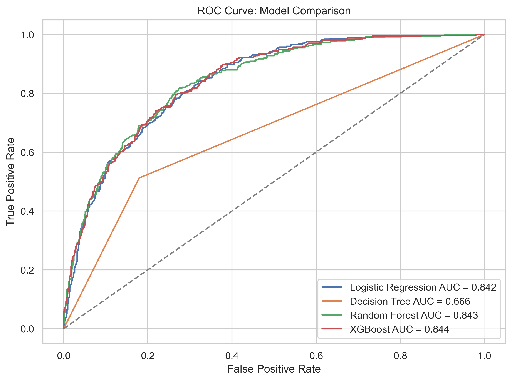
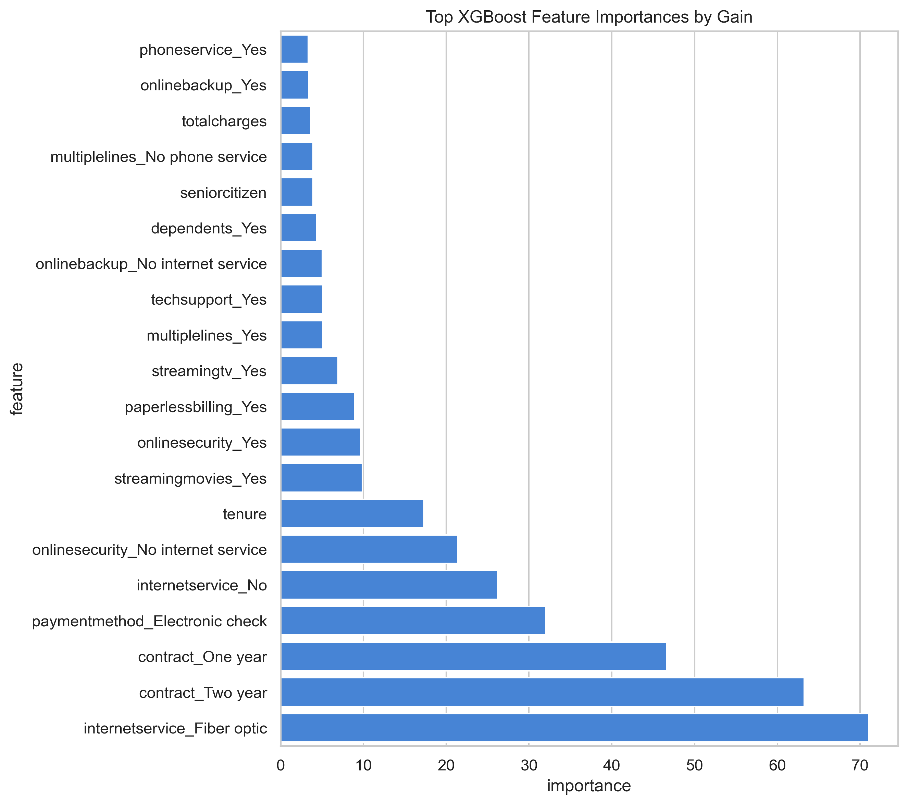
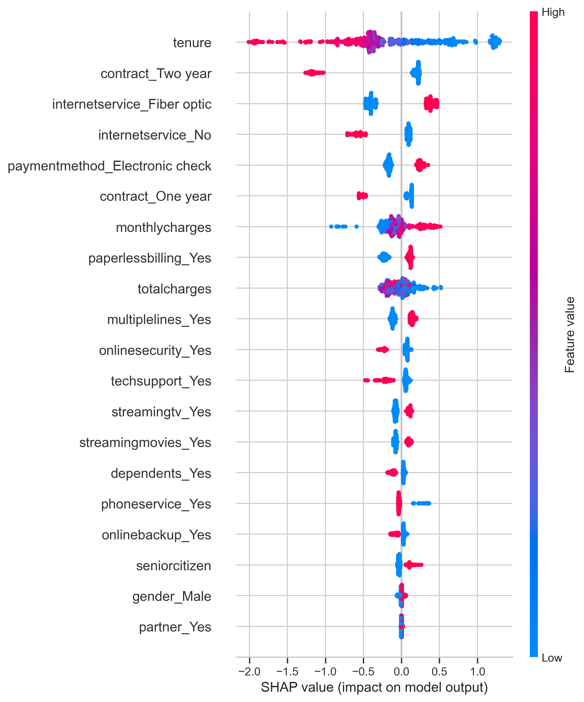

# The Model That Learns From Its Own Mistakes — XGBoost Explained Intuitively

Subtitle: How boosting turned weak Decision Trees into one of the most powerful ML algorithms ever built

Some models learn once.

XGBoost learns, looks at what it got wrong, and comes back with a better attempt.

That is the emotional hook of boosting.

A Decision Tree asks questions. Random Forest asks many trees to vote. XGBoost does something that feels even more deliberate: it builds a sequence of small trees, and each one focuses on the mistakes left behind by the previous ones.

It is machine learning with memory.

Not memory in the human sense. But memory in the training sense: the model keeps track of where it is weak, then spends the next round trying to improve that weak spot.

That is why XGBoost feels smart.

It is not just throwing more trees at the problem.

It is organizing the trees into a learning process.

That difference is the whole story.

## Why Simple Trees Aren’t Enough

A single Decision Tree is easy to love. It is visual. It is direct. It makes decisions like a flowchart.

But a single tree can overfit.

It can memorize the training set so closely that it starts confusing noise for wisdom.

Random Forest improves this by building many trees independently and averaging their votes. That reduces variance.

But XGBoost asks a different question:

> What if each new tree learned from the mistakes of the trees before it?

That is boosting.

## Random Forest vs XGBoost: The Dinner Table Version

Imagine a group of people trying to solve a hard customer churn case.

Random Forest says:

> Everyone make your own judgment independently. Then we will vote.

That is powerful because one person's odd opinion gets softened by the group.

XGBoost says:

> Person one, make a first attempt. Person two, look at where person one struggled and improve that part. Person three, look at what is still wrong and keep improving.

That is a very different kind of teamwork.

Random Forest is parallel wisdom.

XGBoost is sequential improvement.

Neither idea is automatically better in every situation. But XGBoost often shines when there are subtle patterns left behind after simpler models have done their best.

## The Teacher Analogy

Imagine a student taking a practice test.

The teacher does not say, "Start over randomly."

The teacher says:

> You did fine here. But you keep missing these types of questions. Focus there next.

XGBoost behaves like that teacher.

It does not give equal attention to every part of the problem forever. It keeps pushing learning toward the errors.

That is the difference between a crowd voting independently and a team improving sequentially.

## What Is the Model Actually Correcting?

In classification, the idea of "mistakes" can feel a little fuzzy.

The model is not sitting there emotionally embarrassed about wrong predictions.

It is optimizing a loss function.

The loss function tells the model how bad its current predictions are. Gradient boosting looks at how to change predictions so that loss goes down.

You can think of the gradient like a set of arrows.

Each arrow says:

> Move this prediction a little in this direction if you want the error to shrink.

The next tree is trained to follow those arrows.

That is why gradient boosting sounds mathematical but feels intuitive once you see the picture:

> The model keeps stepping downhill on the error landscape.

## What Boosting Actually Means

Boosting combines many weak learners into a strong learner.

A weak learner is usually a simple model, often a small Decision Tree. One weak learner may not be impressive. But if each learner corrects a little bit of what remains wrong, the full model becomes powerful.

The model is additive.

It starts with a rough prediction.

Then it adds a tree.

Then another.

Then another.

Each tree nudges the prediction in a better direction.

## Why Weak Learners Are Not a Weak Idea

The phrase weak learner sounds unimpressive.

But in boosting, weak is a feature, not a flaw.

If each tree is small, it cannot dominate the model too aggressively. It learns a modest correction. Then the next tree learns another correction. Then the next one.

This is like writing a good article.

You do not usually create the final version in one giant heroic draft. You write a rough version, notice what is unclear, revise, notice what still feels weak, revise again.

XGBoost is iterative revision for predictions.

A small tree makes a small improvement.

Many small improvements compound.

## Dataset Story: Customer Churn

In this project, we use the IBM Telco Customer Churn dataset.

The business question:

> Can we predict whether a telecom customer is likely to leave?

Churn is expensive because it means recurring revenue disappears. A churn model can become an early-warning system for the retention team.

The dataset includes contract type, tenure, monthly charges, internet service, tech support, payment method, and other customer attributes.

This is a good XGBoost problem because churn is not driven by one simple rule. It is usually a combination of behavior, pricing, service experience, and customer relationship maturity.

## The Business Meaning of a Churn Score

The model is not really saying:

> This customer will definitely leave.

That would be too dramatic.

It is saying:

> This customer looks more similar to customers who have left than to customers who stayed.

That distinction matters.

In business, an XGBoost churn model is most useful as a ranking system. The retention team can sort customers by predicted risk, then decide what action makes sense.

Machine learning creates prioritization. Strategy decides what to do with it.

## Baselines First

Before building XGBoost, we train baseline models:

- Logistic Regression
- Decision Tree
- Random Forest

This matters because XGBoost should not appear from nowhere like a magic trick.

Logistic Regression gives us a clean linear baseline.

Decision Tree shows the power and fragility of rule-based learning.

Random Forest shows how averaging many trees improves stability.

Then XGBoost shows what happens when trees start learning sequentially from mistakes.

## Watching the Baselines Tell a Story

The baseline models are not filler.

They are the ladder.

Logistic Regression asks:

> Can a relatively simple linear boundary explain churn?

Decision Tree asks:

> Can rule-based splits explain churn?

Random Forest asks:

> Can many independent trees produce a more stable answer?

XGBoost asks:

> Can sequential correction squeeze out a little more signal?

This is how mature model building should feel. You do not jump straight to the famous algorithm. You let simpler models teach you what kind of problem you are dealing with.

## Building XGBoost

In Python, the model looks like this:

```python
XGBClassifier(
    n_estimators=300,
    learning_rate=0.05,
    max_depth=3,
    subsample=0.9,
    colsample_bytree=0.9
)
```

`n_estimators` is the number of boosting rounds.

`learning_rate` controls how strongly each tree contributes.

`max_depth` controls tree complexity.

`subsample` lets each tree see only part of the rows.

`colsample_bytree` lets each tree see only part of the features.

These parameters are not just knobs. They are the personality of the model.

A high learning rate makes the model learn aggressively.

A small learning rate makes it learn carefully.

Deep trees make it expressive.

Shallow trees make it disciplined.

## The Learning Rate Is the Volume Knob

`learning_rate` is one of the most important XGBoost ideas.

Imagine every new tree has something to say.

A high learning rate lets each tree speak loudly.

A low learning rate makes each tree whisper.

Whispering sounds weak, but it can be powerful. If each tree only nudges the model a little, the full model often learns more carefully.

The tradeoff is time.

Small learning rate usually needs more trees.

This is one of the classic XGBoost rhythms:

> Smaller steps, more rounds, better control.

## Why Gradient Boosting Works

Gradient boosting sounds intimidating because of the word gradient.

The intuition is simpler:

> The model looks at the direction of its errors and takes a step that reduces them.

Each new tree is trained to improve the current model.

It is not starting from scratch.

It is continuing the story.

That is why boosting often performs so well on structured data. It keeps finding the parts of the pattern that previous trees missed.



## Reading the ROC Curve

The ROC curve is useful because churn models often support ranked decisions.

We may not only care about a hard yes-or-no prediction. We may care about whether the model can rank customers from lower risk to higher risk.

ROC-AUC helps measure that ranking ability.

In this project, tuned XGBoost edges ahead on ROC-AUC. The improvement is not fireworks. It is a practical improvement.

That is real machine learning.

Sometimes the best model is not dramatically better. It is slightly better, more flexible, and more useful for the decision at hand.

## Feature Importance

XGBoost can tell us which features helped most.



Feature importance can be measured in several ways.

Gain asks:

> How much did this feature improve the model when it was used?

Weight asks:

> How often was this feature used in splits?

Cover asks:

> How many samples were affected by splits using this feature?

Gain is often the most intuitive for storytelling because it focuses on improvement.

## Why Feature Importance Needs Humility

Feature importance is helpful, but it can seduce us into overclaiming.

If contract type is important, that does not prove contract type causes churn by itself.

It means the model found contract type useful for prediction.

The business should treat feature importance as a clue:

- investigate contract friction
- study pricing and support bundles
- compare churn by tenure group
- run retention experiments

The model points to a pattern.

The business still has to test the action.

## SHAP: Explaining the Powerful Model

XGBoost is powerful, but power creates a question:

> Why did the model make this prediction?

SHAP helps answer that.

SHAP assigns each feature a contribution for a prediction. Some features push the prediction toward churn. Others pull it away from churn.



Feature importance tells us what the model uses globally.

SHAP can explain both global patterns and individual customers.

That matters in business. A retention team does not only want to know that tenure matters. They may want to know why this specific customer was flagged.

## SHAP as a Conversation Starter

This is where SHAP becomes more than a plot.

Imagine a retention manager asking:

> Why is this customer high risk?

A generic feature importance chart cannot fully answer that. It can say what matters overall, but not why this customer was scored this way.

SHAP can say:

> This customer's short tenure pushed the prediction toward churn. Their month-to-month contract pushed it further toward churn. Their payment method also increased risk. But their lower monthly charges pulled the prediction slightly away from churn.

That is a more useful conversation.

It does not make the model perfect.

It makes the model discussable.

## Why XGBoost Became Legendary

XGBoost became famous because it is brutally effective on tabular data.

It handles nonlinear relationships.

It captures feature interactions.

It has regularization.

It can be tuned deeply.

It works well in competitions and real business problems.

It is not always the easiest model. But when performance matters, XGBoost is often one of the first serious models practitioners try.

## Why It Wins Competitions

XGBoost became legendary in competitions because many competition datasets are structured tables.

Rows and columns.

Customer attributes.

Transactions.

Product behavior.

Risk signals.

For that kind of data, XGBoost is extremely good at finding nonlinear patterns and interactions without needing deep learning-scale data.

It is also tunable. Competitions reward squeezing small improvements out of models, and XGBoost gives practitioners many ways to do that.

But the same thing that makes it powerful also makes it dangerous: it gives you enough control to overfit if you are careless.

## Where XGBoost Fails

XGBoost can overfit.

It can be sensitive to hyperparameters.

It can take longer to train than simpler models.

It is less naturally interpretable than Logistic Regression.

And it is not always necessary. Sometimes a simpler model is good enough and easier to explain.

## The Real Tradeoff

The honest tradeoff is this:

XGBoost can give you stronger performance, especially on tabular data.

But it asks for more care.

You need to tune it thoughtfully.

You need to validate it honestly.

You need to explain it responsibly.

That is why this project includes baselines, ROC-AUC, feature importance, and SHAP. A powerful model deserves a thoughtful workflow.

## Final Takeaway

XGBoost is the model that learns from its own mistakes.

It does not just build trees.

It builds a sequence of corrections.

Each tree is a small apology for what the previous model got wrong.

That is the beauty of boosting.

It turns weak learners into a strong learner by making improvement systematic.

And that is the big idea worth remembering:

> XGBoost is not powerful because one tree knows everything. It is powerful because every tree gets a chance to fix what is still wrong.

GitHub repo link: `[add GitHub link here]`

Companion interview article: `[add Medium interview article link here]`
